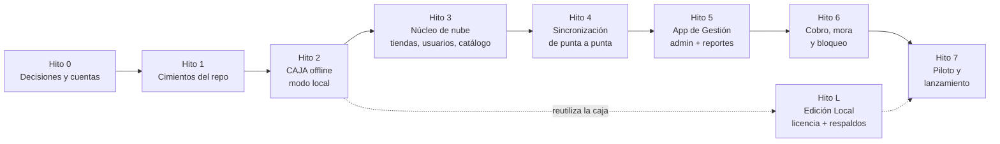

# 00 — Guía de inicio: qué construir primero, paso a paso y con qué tecnologías

**Léelo antes que los demás.** Esta guía convierte la arquitectura (docs 01–10) en un orden de trabajo concreto. Si hay diferencia con el orden de fases del [plan 09](09-plan-implementacion.md), **esta guía manda para el arranque**.

---

## 1. Idea central: construir de lo más riesgoso a lo más rutinario

Lo que puede hacer fracasar el producto no es el CRUD de productos; es:

1. Que **la caja venda sin internet sin perder ni duplicar ventas** (SQLite, outbox, corte de luz).
2. Que **imprima bien** en las impresoras reales de las tiendas (térmicas genéricas, lectores, cajón).
3. Que **la sincronización cuadre al centavo** (idempotencia, inventario por movimientos, fiados).
4. Que el tendero **lo use sin capacitación larga** (velocidad y simplicidad de la pantalla de venta).

Por eso el orden recomendado es:



**Por qué la caja va antes que la nube:** la caja en modo local (sin sincronización) ya es un producto vendible (Edición Local) y permite probar con una tienda real desde pronto, mientras se construye la nube. Todo lo que se aprende ahí (pantalla de venta, impresión, arqueo) no cambia después.

### Alcance del MVP (lo que entra y lo que NO)

| Entra al MVP | Se deja para después |
|---|---|
| Caja offline: venta, pagos mixtos, turnos con arqueo ciego, fiados y abonos, devoluciones con aprobación, reporte del turno, comprobante interno | Promociones, traslados entre bodegas, multi-sucursal |
| Plan **Tendero** y **Negocio** (sin multi-sucursal) | Plan Multi-tienda |
| Sincronización de ventas, turnos, fiados, auditoría; bajada de catálogo, precios, usuarios | Pedidos a proveedores, pagos QR/datáfono integrados |
| App de Gestión: catálogo, usuarios, cajas, clientes/cupos, inventario básico, reportes del día/semana/mes | Reportes de rentabilidad avanzados, ClickHouse |
| Consola del super admin: crear tiendas/usuarios, planes, pagos manuales, prórrogas, suspensión | Cobro automático con tarjeta (se empieza con pagos manuales + link de pago) |
| Mora: avisos y bloqueo por licencia | Cupones y add-ons automáticos |
| Edición Local: licencia, respaldo `.tdbak`, restauración | Edición Local en red con varios PC |

---

## 2. Hito 0 — Decisiones y cuentas (antes de escribir código)

| # | Tarea | Por qué ahora |
|---|---|---|
| 0.1 | Validar el prototipo de la pantalla de venta y el arqueo con 3–5 tenderos reales (puede ser Figma o papel) | Es lo más caro de cambiar después |
| 0.2 | Definir **hardware de referencia**: 1 impresora térmica de 58/80 mm (USB), 1 lector de códigos USB, 1 cajón monedero con pulso por impresora. Comprar una unidad de cada una | Sin hardware real no se puede probar la caja |
| 0.3 | Crear la empresa y el dominio (`tienditaonline.co` o el que elijas); correo corporativo | Certificados, tiendas de apps y pasarelas lo piden |
| 0.4 | Cuentas: GitHub (organización), AWS, Cloudflare, Apple Developer, Google Play Console, Sentry, un proveedor de WhatsApp Business (la aprobación de plantillas tarda) | Algunas aprobaciones demoran; empezar en paralelo |
| 0.5 | Certificado de firma de código para Windows (idealmente EV) | Sin firma, Windows muestra advertencias que espantan al tendero |
| 0.6 | Revisión legal básica: términos del servicio, política de datos (Ley 1581), contrato de encargo de datos, EULA de la Edición Local, texto del comprobante interno y declaración de "no obligado a facturar" | Se necesitan antes del primer cliente |
| 0.7 | Elegir el nombre del producto y la identidad visual mínima | Aparece en instalador, tiquete y licencias |

---

## 3. Tecnologías recomendadas

### 3.1 Resumen por capa

| Capa | Tecnología | Por qué |
|---|---|---|
| Lenguaje de la nube y UI | **TypeScript** (estricto) | Un solo lenguaje para servicios, contratos y pantallas |
| Monorepo | **pnpm** workspaces + **Turborepo** (+ Cargo workspace para Rust) | Builds incrementales y contratos compartidos |
| Caja (instalable) | **Tauri 2** (Rust + WebView) con UI **React + Vite + TypeScript** | Ligero (PCs viejos), acceso nativo a impresora/cifrado, mismo UI que la Edición Local |
| BD local de la caja | **SQLite + SQLCipher** (`rusqlite` con `bundled-sqlcipher-vendored-openssl`), modo WAL | Cifrado, transaccional, sin servidor |
| Núcleo Rust (caja) | `rusqlite`, `rusqlite_migration`, `serde`, `uuid` (v7), `argon2`, `ed25519-dalek`, `sha2`, `aes-gcm`, `tokio`, `reqwest` (solo build `cloud`), `tracing`, `keyring`/DPAPI para guardar la llave del equipo | Cubre cifrado, PIN, firma, respaldos y red |
| UI de la caja | React 18 + **Zustand** (estado) + **TanStack Query** (reportes online) + **Tailwind CSS** + componentes propios grandes y táctiles | Velocidad de interfaz y botones grandes |
| App de Gestión | **Expo** (React Native + React Native Web) + **Expo Router** + TanStack Query + React Hook Form + Zod + **NativeWind** | Un código para web, iOS y Android |
| Gráficas | Victory Native / Recharts (web) detrás de `packages/ui-reports` | Mismas pantallas en ambos frontends |
| Microservicios | **Node.js 22 LTS + NestJS** + Fastify adapter | Estructura clara por módulo, buena inyección de dependencias |
| Acceso a datos | **Drizzle ORM** para consultas; **migraciones en SQL escrito a mano** (las de la carpeta `db/cloud`) ejecutadas con **dbmate** | RLS, particiones y `xid8` se manejan mejor en SQL puro |
| Validación | **Zod** (contratos compartidos con la caja vía JSON Schema) | Un solo origen de verdad de los eventos |
| BD en la nube | **PostgreSQL 16** (Aurora PostgreSQL o RDS) | RLS, particiones, `xid8` |
| Mensajería | **Kafka-compatible**: **Redpanda** (local y etapa inicial) → **Amazon MSK** al crecer | Mismo protocolo; Redpanda es más liviano |
| Cliente Kafka | `kafkajs` (simple) o el cliente oficial de Confluent para Node | Productor idempotente y consumidores con inbox |
| Caché / límites | **Redis 7** | Rate limit, caché de BFF, bloqueos |
| Identidad | **Keycloak** (autoalojado) o **Amazon Cognito** (gestionado) | OIDC, MFA, WebAuthn. Para equipo pequeño: Cognito |
| Gateway | **Kong** (o Envoy) | JWT, rate limit, enrutamiento |
| Archivos | **S3** (+ URLs prefirmadas) | Bootstrap de catálogo, exportaciones, comprobantes de pago |
| Correo / SMS / WhatsApp / Push | **Amazon SES**, proveedor de SMS local, **WhatsApp Cloud API** (o un BSP), **Expo Push** | Ver doc 10 §3 |
| Observabilidad | **OpenTelemetry** → Grafana Cloud (Tempo/Loki/Mimir) + **Sentry** | Menos operación que autoalojar |
| IaC | **Terraform** + GitHub Actions | Reproducible |
| Contenedores | **Docker**; etapa inicial en **ECS Fargate**; **EKS** cuando haya muchos servicios en producción | Menos costo y operación al inicio |
| Pruebas | **Vitest** (TS), `cargo test` (Rust), **Testcontainers** (Postgres/Redpanda), **Playwright** (web), **k6** (carga), **Pact** (contratos BFF↔servicios) | Ver §8 |
| Calidad | ESLint, Prettier, `cargo clippy`, `cargo fmt`, Husky + commitlint, Semgrep, Trivy | Estándar |

### 3.2 Despliegue por etapas (para controlar el costo)

Los **microservicios se escriben y se versionan por separado desde el primer día** (código, contratos y bases de datos independientes). Lo que cambia con la escala es **cómo se despliegan**:

| Etapa | Cuándo | Despliegue | Costo/operación |
|---|---|---|---|
| **A. Piloto** | Hasta ~50 tiendas | Servicios en contenedores sobre **ECS Fargate** (pocas tareas pequeñas, varios servicios pueden compartir tarea con procesos separados), **un clúster Aurora Serverless v2** con una base de datos por servicio, **Redpanda Cloud** o MSK Serverless, Redis pequeño, Cloudflare | Bajo; poca operación |
| **B. Crecimiento** | Cientos de tiendas | Cada servicio con su propio autoescalado, réplicas de lectura para `reporting-service`, alertas y guardias | Medio |
| **C. Escala** | Miles de tiendas | **EKS** + Linkerd + KEDA + ArgoCD (como en el doc 05), shards para tenants grandes, ClickHouse | Alto; justificado por ingresos |

Pasar de A a C **no requiere reescribir servicios**, porque ya hablan por eventos y tienen sus propias bases de datos.

---

## 4. Hito 1 — Cimientos del repositorio

### Paso 1.1 — Instalar herramientas en Windows (PowerShell)

```powershell
winget install Git.Git
winget install OpenJS.NodeJS.LTS
winget install Rustlang.Rustup
winget install Docker.DockerDesktop
winget install Microsoft.EdgeWebView2Runtime
# Visual Studio Build Tools con la carga "Desktop development with C++" (requerido por Rust/Tauri)
winget install Microsoft.VisualStudio.2022.BuildTools
# Perl (necesario para compilar OpenSSL embebido de SQLCipher)
winget install StrawberryPerl.StrawberryPerl

corepack enable
corepack prepare pnpm@latest --activate
rustup default stable
```

Extensiones de VS Code recomendadas: rust-analyzer, Tauri, ESLint, Prettier, Docker, PostgreSQL (o SQLTools), Thunder Client, Mermaid.

### Paso 1.2 — Crear el monorepo

```powershell
cd "C:\Users\Camilo Tello\Desktop\TienditaOnline"
git init
pnpm init
pnpm add -Dw turbo typescript prettier eslint vitest
```

`pnpm-workspace.yaml`:

```yaml
packages:
  - "apps/*"
  - "services/*"
  - "packages/*"
```

`turbo.json` (resumen):

```json
{
  "tasks": {
    "build": { "dependsOn": ["^build"], "outputs": ["dist/**"] },
    "test":  { "dependsOn": ["^build"] },
    "lint":  {},
    "dev":   { "cache": false, "persistent": true }
  }
}
```

Carpetas (las de [09 §1](09-plan-implementacion.md)): `apps/pos`, `apps/management`, `apps/platform-console`, `services/*`, `packages/{contracts,service-kit,tax-engine,ui-reports,admin-ui,config}`, `db/`, `infra/`, `tools/terminal-simulator`.

### Paso 1.3 — Infraestructura local (Docker Compose)

`infra/local/docker-compose.yml` (resumen de lo necesario):

```yaml
services:
  postgres:
    image: postgres:16
    environment: { POSTGRES_PASSWORD: dev }
    ports: ["5432:5432"]
    volumes:
      - ./initdb:/docker-entrypoint-initdb.d   # crea una BD por servicio
  redis:
    image: redis:7
    ports: ["6379:6379"]
  redpanda:
    image: redpandadata/redpanda:latest
    command: >
      redpanda start --overprovisioned --smp 1 --memory 1G --reserve-memory 0M
      --node-id 0 --check=false
      --kafka-addr PLAINTEXT://0.0.0.0:9092
      --advertise-kafka-addr PLAINTEXT://localhost:9092
    ports: ["9092:9092"]
  redpanda-console:
    image: redpandadata/console:latest
    environment: { KAFKA_BROKERS: "redpanda:9092" }
    ports: ["8080:8080"]
  keycloak:
    image: quay.io/keycloak/keycloak:latest
    command: start-dev
    environment: { KEYCLOAK_ADMIN: admin, KEYCLOAK_ADMIN_PASSWORD: dev }
    ports: ["8081:8080"]
  minio:
    image: minio/minio
    command: server /data --console-address ":9001"
    ports: ["9000:9000", "9001:9001"]
  mailpit:                    # correos de prueba
    image: axllent/mailpit
    ports: ["8025:8025", "1025:1025"]
```

`infra/local/initdb/01-databases.sql`:

```sql
CREATE DATABASE tenant_db;    CREATE DATABASE identity_db;  CREATE DATABASE device_db;
CREATE DATABASE catalog_db;   CREATE DATABASE sync_db;      CREATE DATABASE sales_db;
CREATE DATABASE cash_db;      CREATE DATABASE inventory_db; CREATE DATABASE customer_db;
CREATE DATABASE reporting_db; CREATE DATABASE audit_db;     CREATE DATABASE notification_db;
```

Luego aplicar, en cada base de datos, [db/cloud/000_common.sql](../db/cloud/000_common.sql) y los scripts de su servicio con `dbmate`.

> Los scripts SQL actuales **nunca se han ejecutado**. Este paso es la primera prueba real: ejecútalos, corrige los errores que aparezcan y deja un comando `pnpm db:migrate` que los aplique todos.

### Paso 1.4 — `packages/contracts` (el primer código real)

Antes que cualquier servicio, define los **eventos** con Zod. Es el idioma común entre la caja, la nube y la App de Gestión.

```ts
// packages/contracts/src/envelope.ts
import { z } from "zod";

export const EventEnvelope = z.object({
  event_id: z.string().uuid(),
  event_type: z.string(),
  schema_version: z.number().int().positive(),
  tenant_id: z.string().uuid(),
  branch_id: z.string().uuid(),
  terminal_id: z.string().uuid(),
  terminal_seq: z.number().int().positive(),
  occurred_at: z.string().datetime({ offset: true }),
  hlc: z.string(),
  actor_id: z.string().uuid(),
  payload: z.unknown(),
  payload_hash: z.string().startsWith("sha256:"),
});

// packages/contracts/src/sale-completed.v1.ts (esbozo)
export const SaleCompletedV1 = z.object({
  sale_id: z.string().uuid(),
  receipt_prefix: z.string(), receipt_number: z.number().int(),
  cash_session_id: z.string().uuid(), cashier_id: z.string().uuid(),
  customer_id: z.string().uuid().nullable(),
  lines: z.array(z.object({
    product_id: z.string().uuid(), description: z.string(),
    qty_milli: z.number().int(), unit_price_cents: z.number().int(),
    discount_cents: z.number().int(), tax_detail: z.array(z.unknown()),
    line_total_cents: z.number().int(),
  })),
  payments: z.array(z.object({
    method: z.string(), amount_cents: z.number().int(),
    tendered_cents: z.number().int().nullable(), reference: z.string().nullable(),
  })),
  totals: z.object({ subtotal_cents: z.number().int(), discount_cents: z.number().int(),
    tax_cents: z.number().int(), total_cents: z.number().int(), rounding_cents: z.number().int() }),
  is_credit: z.boolean(),
});
```

Script que genera **JSON Schema** desde Zod (`zod-to-json-schema`) y los tipos Rust para la caja (`typify` o `schemafy`). Prueba de contrato en CI.

### Paso 1.5 — `packages/service-kit` y plantilla de servicio

Un paquete interno con lo que **todo** microservicio necesita, para no repetirlo 15 veces:

| Pieza | Qué hace |
|---|---|
| `withTenant(tx, tenantId)` | Ejecuta `SET LOCAL app.tenant_id` por transacción (RLS) |
| `OutboxRelay` | Lee `outbox` sin publicar y publica a Kafka con `acks=all`; marca `published_at` |
| `inbox.once(eventId, consumer, fn)` | Inserta en `inbox` y ejecuta el efecto en la misma transacción |
| `Consumer` base | Reintentos con topics `.retry`, `.dlt`, backoff con jitter |
| `CircuitBreaker` | Envoltorio (`opossum`) para llamadas salientes |
| `health` | `/health/live` y `/health/ready` |
| `otel` | Trazas y métricas, con propagación de contexto en headers de Kafka |
| `auth` | Validación JWT y lectura de `tenant_id` |
| `problem` | Errores en formato RFC 9457 |

Con eso, un **generador** (`pnpm gen:service nombre`) crea un servicio NestJS nuevo con todo conectado. Prueba: un servicio “eco” que publica un evento y otro que lo consume con inbox, con traza completa en Grafana/Tempo local.

**Terminado el Hito 1 cuando:** `pnpm install && pnpm dev:infra && pnpm db:migrate && pnpm test` corre limpio en una máquina nueva, y el CI de GitHub Actions hace lint + pruebas + escaneo de secretos.

---

## 5. Hito 2 — La caja offline (modo local)

Se construye **sin depender de la nube**. Orden interno recomendado:

| Paso | Qué se construye | Cómo saber que funciona |
|---|---|---|
| 2.1 | Proyecto Tauri 2 + React; build `local` y `cloud` con *features* de Cargo. Ventana a pantalla completa, modo kiosco opcional | `pnpm tauri dev` abre la caja |
| 2.2 | SQLCipher + migraciones ([db/local/001_schema.sql](../db/local/001_schema.sql)); `PRAGMA journal_mode=WAL; synchronous=FULL`; clave de la base en DPAPI/keystore | La base no se puede abrir con un visor SQLite normal |
| 2.3 | **Motor de impuestos** (`packages/tax-engine` en TS y la versión Rust) con **golden tests** compartidos: mismo archivo JSON de casos, mismos resultados al centavo | Los 200+ casos pasan en ambos lenguajes |
| 2.4 | Dominio de venta: carrito, líneas, descuentos, redondeo, artículo genérico, pesaje | Pruebas unitarias del dominio |
| 2.5 | **Comando `CompleteSale` atómico**: venta + líneas + pagos + movimientos de stock + fiado + auditoría + consecutivo interno + evento en `outbox`, todo en una transacción | Prueba que mata el proceso (`kill -9`) durante el cobro: nunca queda una venta a medias ni un consecutivo repetido |
| 2.6 | Pantalla de venta: escáner (teclado HID), búsqueda por nombre, atajos de teclado, botones táctiles grandes, cobro en efectivo/mixto, cambio | Cobrar una venta de 5 productos en menos de 15 segundos con el teclado |
| 2.7 | Impresión: plantilla de comprobante (58 y 80 mm) con ESC/POS por USB o por el spooler de Windows (modo RAW) + pulso al cajón | Imprime y abre el cajón con la impresora real |
| 2.8 | Turnos: apertura con base, movimientos de efectivo, **arqueo ciego**, reporte Z | El descuadre calculado coincide con un conteo manual |
| 2.9 | Usuarios locales + **PIN** (Argon2id), bloqueo por intentos, aprobación de supervisor/dueño | Un cajero no puede anular sin PIN de aprobador |
| 2.10 | Clientes y fiados (cupo, abonos, saldo estimado), devoluciones/anulaciones | El saldo del cliente se actualiza y cuadra |
| 2.11 | Reporte del turno y reimpresión auditada | Imprime y queda en auditoría |
| 2.12 | Pruebas de campo en una tienda real con datos reales (modo local) | El tendero vende un día completo sin ayuda |

Reglas que se cumplen desde el primer commit de la caja:
- La UI **nunca** toca SQLite; solo llama comandos de Rust.
- Dinero siempre en **centavos enteros**; cantidades en **milésimas enteras**.
- Todo comando de negocio devuelve error tipado; nada de `unwrap()` en rutas de venta.
- Todos los IDs son **UUIDv7**.

**Terminado el Hito 2 cuando:** una tienda piloto vende un día completo en modo local, imprime todos los comprobantes, hace el arqueo y no hay datos perdidos tras apagar el equipo bruscamente.

---

## 6. Hito 3 — Núcleo de la nube

Servicios, en este orden (cada uno con su BD, RLS, pruebas de aislamiento y eventos):

| Paso | Servicio / app | Contenido mínimo |
|---|---|---|
| 3.1 | `identity-service` | Usuarios, roles y permisos sembrados ([002_roles_permissions_seed.sql](../db/cloud/identity-service/002_roles_permissions_seed.sql)), integración con Keycloak/Cognito, activación de cuenta, PIN con Argon2id |
| 3.2 | `tenant-service` | Tiendas, sucursales, planes, suscripciones, estados, entitlements |
| 3.3 | `device-service` | Cajas, código de enrolamiento, llaves del dispositivo, licencia firmada (llave en KMS), heartbeat |
| 3.4 | `catalog-service` | Productos, códigos de barras, impuestos, precios por sucursal, importación desde Excel |
| 3.5 | `bff-platform` + `apps/platform-console` | Consola del super admin: crear tienda + dueño + sucursal + `CAJA-01` (saga), planes |
| 3.6 | `bff-app` (parte administración) + `apps/management` | App de Gestión: activar cuenta, login con MFA, catálogo, usuarios/cajeros, cajas con QR |

**Terminado el Hito 3 cuando:** creas una tienda desde la consola, el dueño activa su cuenta desde el celular, carga productos y crea un cajero; y las pruebas confirman que una tienda **no puede leer nada de otra**.

---

## 7. Hito 4 — Sincronización de punta a punta (el “esqueleto andante”)

Es el hito más importante de la nube. Se construye como **una rebanada vertical** y se valida antes de agregar más cosas:

> **Caso de oro:** una caja sin internet vende 3 productos → vuelve el internet → la venta aparece en la base de la nube, descuenta inventario, suma en el reporte del día y se ve en el celular.

| Paso | Qué se construye |
|---|---|
| 4.1 | `sync-service`: `POST /v1/sync/push` (idempotencia, orden por `terminal_seq`, event store, outbox → `pos.events`) |
| 4.2 | Motor de sincronización en la caja (build `cloud`): outbox, reintentos con backoff + jitter, circuit breaker, heartbeat |
| 4.3 | Enrolamiento real de la caja (código/QR) + licencia + descarga inicial del catálogo (*bootstrap*) |
| 4.4 | `sales-service`, `cash-service`, `inventory-service`, `customer-service`, `audit-service` como consumidores con inbox |
| 4.5 | Bajada incremental: `downstream_changes` en `sync-service` + `GET /v1/sync/pull` con cursor `xid8` |
| 4.6 | `reporting-service` mínimo (ventas del día) |
| 4.7 | **Simulador de cajas** (`tools/terminal-simulator`): N cajas virtuales que venden, se desconectan, reenvían lotes, repiten eventos y provocan huecos |

Pruebas obligatorias de este hito:
- Reenviar el **mismo lote 100 veces en paralelo** → un solo efecto contable.
- Apagar `inventory-service` 30 minutos → las cajas siguen sincronizando y, al volver, el stock queda correcto.
- Dos cajas offline venden la última unidad → stock negativo con alerta, sin perder ventas.
- Un evento con `terminal_seq` faltante → `GAP_DETECTED` y reenvío.

**Terminado el Hito 4 cuando:** el caso de oro funciona y las cuatro pruebas pasan en el CI.

---

## 8. Estrategia de pruebas (desde el principio)

| Nivel | Herramienta | Qué cubre | Obligatorio en |
|---|---|---|---|
| Unitarias | Vitest / `cargo test` | Dominio de venta, impuestos, caja, fiados, licencias | Todo PR |
| Golden tests | Archivo JSON compartido | Cálculo de impuestos idéntico en Rust y TypeScript | Todo PR |
| Aislamiento de tenant | Pruebas de integración | Cada endpoint intenta leer/escribir datos de otra tienda y debe fallar | Todo servicio nuevo |
| Integración | Testcontainers (Postgres + Redpanda) | Outbox/inbox, idempotencia, migraciones | Todo PR |
| Contrato | Schema Registry + Pact | Eventos y BFF ↔ servicios | Todo PR |
| Corte de energía | Pruebas que matan el proceso en la caja | Atomicidad de la venta | Cada release de la caja |
| E2E | Playwright (App de Gestión web) + simulador de cajas | Caso de oro y flujos de administración | Cada release |
| Carga | k6 | Reconexión masiva (miles de cajas con eventos pendientes) | Antes del piloto y cada trimestre |
| Hardware | Lista manual con impresoras/lectores de referencia | Impresión, cajón, lector | Cada release de la caja |
| Seguridad | Semgrep, `npm audit`, `cargo audit`, Trivy, pentest externo | Dependencias y código | CI + antes del lanzamiento |

---

## 9. Hito 5 — App de Gestión: administración y reportes

1. `reporting-service` completo: ventas por periodo, sucursal, caja, cajero, medio de pago, productos top, turnos y descuadres, cartera, inventario, estado de cajas.
2. `bff-app` con rutas `/v1/app/*` y `/v1/app/reports/*`; SSE para el dashboard.
3. App de Gestión: dashboard, reportes, inventario (recepciones, ajustes, conteos con la cámara), clientes y cupos, artículos genéricos por crear, conciliación de pagos digitales, cuarentena de sincronización.
4. `notification-service`: push, correo y WhatsApp (descuadre, caja sin sincronizar, stock negativo).
5. Publicación: web en Cloudflare Pages (o S3 + CDN); móvil con **EAS Build/Submit** a App Store y Google Play; actualizaciones OTA con EAS Update.

## 10. Hito 6 — Cobro, mora y bloqueo

1. Aplicar [002_plans_billing.sql](../db/cloud/tenant-service/002_plans_billing.sql): facturas, pagos, política de mora.
2. Job diario de mora (idempotente): avisos D−5…D+5, `RESTRICTED` D+7, `SUSPENDED` D+15, `CANCELLED` D+60.
3. Consola: registrar pago manual con comprobante, prórroga con motivo, suspender/reactivar.
4. Licencia de la caja con `exp = mínimo(fecha pagada + 15 días, última conexión + gracia)`; la caja no abre turnos nuevos si está `SUSPENDED`.
5. Pasarela de pagos (Wompi / PayU / Mercado Pago): primero **link de pago + webhook**; después cobro automático con tarjeta.
6. Pruebas: simular el paso de los días con un reloj falso y verificar cada transición de estado.

## 11. Hito L — Edición Local (se puede adelantar después del Hito 2)

1. Build `local` sin sincronización; contraseña de administrador (Argon2id) y código de recuperación.
2. Pantallas de administración reutilizando `packages/admin-ui` con un proveedor de datos local.
3. Activación en línea (una sola vez): `/v1/local-activation/*` en `device-service`, huella tolerante 3 de 5, llave del equipo en TPM/DPAPI, licencia firmada.
4. Respaldo `.tdbak` cifrado y verificado, solicitud de cambio de equipo, restauración.
5. Módulo de licencias en la consola (crear serial, ver activaciones, liberar, revocar, renovar).
6. Instalador firmado (MSI/NSIS con Tauri), auto-actualización controlada por `updates_until`.

## 12. Hito 7 — Piloto y lanzamiento

1. Pentest externo, prueba de carga (reconexión masiva), simulacro de restauración de base de datos y de caída de un servicio.
2. Piloto con **5–10 tiendas** de barrio, mezclando nube y Edición Local; reunión semanal con los tenderos; métricas de uso.
3. Ajustar precios y planes con lo aprendido.
4. Materiales de soporte: videos cortos, guía impresa, línea de WhatsApp.
5. Lista de salida a producción de [09 §6](09-plan-implementacion.md).

---

## 13. Primeros pasos concretos (lista de arranque)

- [ ] Crear el repositorio en GitHub y proteger la rama principal (PR obligatorio + CI).
- [ ] Instalar herramientas (§4.1) y verificar con `node -v`, `pnpm -v`, `rustc --version`, `docker --version`.
- [ ] Crear el monorepo y `docker-compose` local (§4.2–4.3).
- [ ] Ejecutar los scripts SQL actuales contra Postgres local y corregir lo que falle.
- [ ] Escribir `packages/contracts` con el sobre y `sale.completed.v1` (§4.4).
- [ ] Crear `apps/pos` con Tauri y abrir SQLCipher con una tabla de prueba.
- [ ] Escribir el primer *golden test* de impuestos (IVA 19 % incluido en el precio).
- [ ] Comprar y conectar la impresora de referencia; imprimir “Hola” por ESC/POS.
- [ ] Reunirse con 3 tenderos para mostrar el prototipo de la pantalla de venta.

---

## 14. Errores comunes que conviene evitar

| Error | Consecuencia | Qué hacer |
|---|---|---|
| Empezar por el CRUD de la nube y dejar la caja para el final | El riesgo grande se descubre tarde | Seguir el orden de esta guía |
| Usar `float` para dinero | Descuadres de centavos | Enteros en centavos |
| Dejar que la UI escriba en la base local | Ventas inconsistentes | Solo comandos de Rust |
| Compartir bases de datos entre servicios | Se pierde la independencia | Una BD por servicio, eventos para el resto |
| Procesar eventos sin inbox | Dobles conteos al reintentar | `inbox.once` siempre |
| Probar solo con internet estable | Fallos en tiendas reales | Simulador con cortes y duplicados |
| Pantalla de venta con muchos pasos | El tendero la abandona | Medir segundos por venta, atajos de teclado |
| Dejar la firma de código y las cuentas de tiendas de apps para el final | Retrasos de aprobación | Hito 0 |
| No probar el instalador en un PC limpio con Windows 10 | “En mi máquina funciona” | Probar en máquina virtual limpia en cada release |
| Poner secretos en el repositorio | Filtraciones | Secrets Manager + escaneo de secretos en CI |

---

## 15. Si desarrollas con un equipo muy pequeño (1–3 personas)

- Haz los Hitos 0, 1 y 2 completos y llega a una tienda real con la **Edición Local** antes de construir la nube.
- En la nube, escribe los servicios como **proyectos separados**, pero ejecútalos juntos en pocos contenedores (etapa A de §3.2).
- Pospón: multi-sucursal, promociones, traslados, pagos QR, cobro automático con tarjeta, ClickHouse.
- Usa servicios gestionados (Aurora, Redpanda Cloud, Cognito, Grafana Cloud) en vez de operar tú la infraestructura.
- Automatiza desde el inicio el CI, las migraciones y el despliegue: es lo que más tiempo ahorra después.
