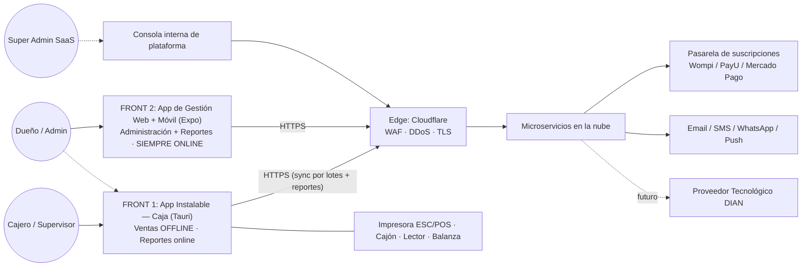
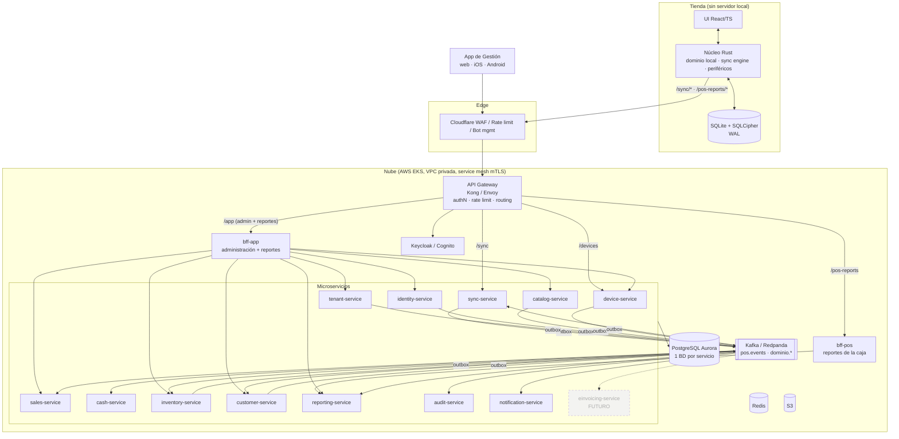
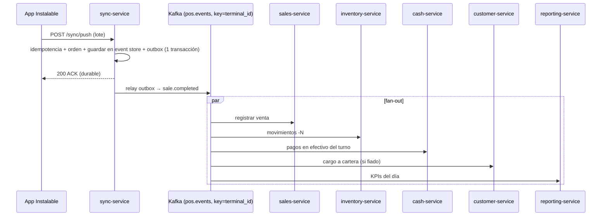
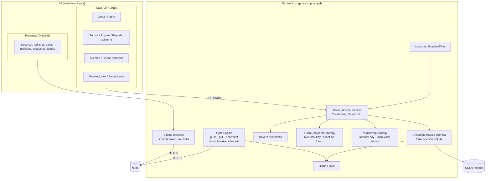

# 01 — Arquitectura General

## 1. Vista de contexto (C4 nivel 1)

Población objetivo inicial: **tiendas de barrio** (mayoritariamente no obligadas a facturar electrónicamente). La facturación electrónica DIAN queda **diseñada y mapeada como módulo futuro** (ver [06](06-cumplimiento-colombia.md)), sin desplegarse en la fase actual.

### Los dos frontends

**Regla de conectividad:** lo único que funciona sin internet es **la caja** (vender y lo indispensable para vender). Todo lo demás exige conexión.

| Front | Tecnología | Usuarios | Funciones | Conectividad |
|---|---|---|---|---|
| **1. App Instalable (Caja)** | Tauri 2 (Rust + React/TS), Windows y Android (tablet) | Cajero, supervisor (y dueño/admin cuando atiende la caja) | **Caja:** ventas, cobro, pagos mixtos, turnos y arqueo, fiados y abonos, alta rápida de cliente, devoluciones/anulaciones, reimpresión, reporte del turno. **Reportes** de la sucursal | Caja 100 % offline. Reportes consolidados: solo con internet |
| **2. App de Gestión** | **Expo (React Native + React Native Web)**: un solo código para web, iOS y Android | Dueño, admin de sucursal, (opcional) contador en solo lectura | **Administración:** registro del negocio, suscripción, sucursales, cajas (enrolamiento/revocación), usuarios/roles/PIN, catálogo, precios, promociones, clientes y cupos, inventario (recepciones, ajustes, conteos con escáner de cámara, traslados), conciliación de pagos digitales, cuarentena. **Reportes** completos y notificaciones push | **Siempre online**. Sin conexión muestra pantalla de "Sin conexión" (no hay modo offline ni datos en caché editables) |

Consecuencias:

- La caja **no** tiene módulo de administración. Si el producto escaneado no existe, se vende como **artículo genérico** con precio manual (permiso de supervisor) y queda registrado para crearlo después desde la App de Gestión.
- Las operaciones de inventario que no son ventas (recepciones, ajustes, conteos) se hacen en la App de Gestión; el celular sirve de escáner (cámara o lector Bluetooth).
- Como la App de Gestión siempre está en línea, sus escrituras son **síncronas contra el servicio dueño** (validación inmediata, control optimista por `version`); no necesita outbox local ni resolución de conflictos.
- La consola de super administrador (`platform-console`) es una herramienta **interna** construida con el mismo stack, en un host separado con acceso restringido. Desde ahí **el super admin crea las tiendas y sus dueños**, administra planes, cobros, bloqueos y licencias locales ([10](10-roles-planes-licenciamiento.md)).
- Existe además una **Edición Local** (pago único) que es la misma App Instalable compilada sin nube, con administración local por contraseña ([10 §4](10-roles-planes-licenciamiento.md)).

## 2. Vista de contenedores — microservicios (C4 nivel 2)

## 3. Estilo arquitectónico

| Decisión | Elección | Motivo |
|---|---|---|
| Backend | **Microservicios** por bounded context (DDD), cada uno con su propia base de datos | Escalado y despliegue independientes; la ingesta de ventas escala distinto a reportes o catálogo; aislamiento de fallos |
| Comunicación | **Asíncrona por eventos** (Kafka) para todo lo que viene de las cajas; **síncrona** (HTTP/gRPC) desde los BFF para lecturas y para las escrituras administrativas de la App de Gestión | Las ventas ya ocurrieron en la caja (*hechos*); la administración es online y necesita validación inmediata |
| Datos | **Database-per-service** (un clúster Aurora con BD y credenciales separadas por servicio al inicio; separables después) | Autonomía sin costo inicial excesivo |
| Consistencia | Eventual entre servicios; **transactional outbox** + **idempotent consumer (inbox)** en todos | Sin transacciones distribuidas (2PC) |
| Procesos multi-servicio | **Sagas orquestadas** solo donde hay decisiones (onboarding de tenant, cambio de plan, enrolamiento) | Compensaciones explícitas |
| Multi-tenancy | Columna `tenant_id` + **Row-Level Security** en cada BD de servicio | Defensa en profundidad |
| Frontends | 2 productos + **BFF** (Backend for Frontend) por producto | Cada front recibe datos a su medida; la caja solo lee reportes por BFF y escribe por sync |
| Lectura | **CQRS**: `reporting-service` construye modelos de lectura desde eventos | Reportes rápidos sin tocar BDs transaccionales |

### Catálogo de microservicios

| Servicio | Responsabilidad | BD propia | Publica | Consume |
|---|---|---|---|---|
| `tenant-service` | Tenants, planes, suscripciones, sucursales, modo fiscal, features | `tenant_db` | `tenant.*`, `subscription.*`, `branch.*` | pagos de suscripción |
| `identity-service` | Usuarios, roles, permisos, PIN (hash), MFA (con IdP) | `identity_db` | `user.*`, `role.*` | `tenant.created` |
| `device-service` | Enrolamiento de cajas, licencias firmadas, heartbeat, revocación | `device_db` | `terminal.*` | `tenant.*`, `subscription.*` |
| `catalog-service` | Productos, códigos, impuestos, precios por sucursal, promociones | `catalog_db` | `catalog.*` | — |
| `sync-service` | Ingesta de lotes (idempotencia, orden), event store de cajas, modelo de bajada por caja | `sync_db` | `pos.events` | `catalog.*`, `user.*`, `customer.*`, `inventory.level_changed`, `tenant.*` |
| `sales-service` | Ventas, pagos, devoluciones, conciliación de pagos digitales | `sales_db` | `sales.*` | `pos.events` |
| `cash-service` | Turnos, movimientos, arqueos, descuadres | `cash_db` | `cash.*` | `pos.events` |
| `inventory-service` | Libro de movimientos, existencias, ajustes, traslados | `inventory_db` | `inventory.*` | `pos.events`, `catalog.*` |
| `customer-service` | Clientes, cartera (fiados), abonos | `customer_db` | `customer.*` | `pos.events` |
| `reporting-service` | Dashboards, KPIs, exportaciones (CQRS) | `reporting_db` (+ ClickHouse después) | — | todos los tópicos |
| `audit-service` | Bitácora inmutable encadenada | `audit_db` | — | `pos.events`, `*.admin_action` |
| `notification-service` | Email, SMS, WhatsApp, push móvil | `notification_db` | — | alertas de todos |
| `einvoicing-service` | **FUTURO**: resoluciones DIAN, bloques, XML, proveedor tecnológico | `einvoicing_db` | `einvoice.*` | `sales.*`, `tenant.features_changed` |
| `bff-pos` | Reportes de la sucursal para la App Instalable (solo lectura) | sin BD (caché Redis) | — | — |
| `bff-app` | API de administración + reportes para la App de Gestión (web/móvil) | sin BD (caché Redis) | `*.admin_action` | — |
| `bff-platform` | API de la consola del super admin (tiendas, usuarios, planes, cobros, licencias locales) | sin BD | `*.admin_action` | — |

Reglas:
- Un servicio **nunca** lee la base de datos de otro. Si necesita datos ajenos, mantiene una **réplica local** alimentada por eventos (p. ej. `device-service.tenant_limits_replica`).
- Las escrituras administrativas (catálogo, usuarios) van del BFF al servicio dueño por HTTP/gRPC; el servicio publica el evento y los demás reaccionan.
- Contratos de eventos versionados en `packages/contracts` con *schema registry* (compatibilidad hacia atrás obligatoria).

### Flujo de una venta a través de los servicios

El ACK a la caja ocurre cuando el evento es **durable en `sync-service`**, no cuando todos los consumidores lo procesaron. Así la caja libera su outbox rápido y una caída de `inventory-service` no frena la sincronización.

## 4. Stack tecnológico recomendado

| Capa | Tecnología | Alternativa |
|---|---|---|
| App Instalable | **Tauri 2** (Rust + React/TypeScript), SQLite con **SQLCipher**, modo WAL | Electron + better-sqlite3 (más pesado, más RAM) |
| Periféricos | Crates Rust: `escpos`, `serialport`, `rusb`; impresión por USB/Red/Bluetooth; lector como teclado HID | Servicio nativo Windows |
| App de Gestión (admin + reportes) | **Expo SDK + Expo Router** (React Native + React Native Web), TanStack Query, React Hook Form + Zod, Victory/Recharts, `expo-camera` para escanear códigos, notificaciones push (Expo Notifications) | Flutter (web menos madura) |
| Microservicios | Node.js 22 LTS + **NestJS** + TypeScript, ORM **Drizzle**, validación **Zod**, KafkaJS | Go para `sync-service` si la ingesta lo exige |
| BD transaccional | **PostgreSQL 16** (Amazon Aurora) — una BD por servicio + PgBouncer | — |
| Cache / locks | Redis 7 (ElastiCache) | — |
| Mensajería | **Kafka** (Amazon MSK Serverless o Redpanda) con Schema Registry | RabbitMQ (sin replay) |
| Object storage | S3 (versionado; Object Lock cuando se active facturación electrónica) | — |
| Identidad | Keycloak (OIDC) o Amazon Cognito | Auth0 |
| Gateway | Kong / Envoy | AWS API Gateway |
| Service mesh | **Linkerd** (mTLS automático, retries, timeouts, métricas) | Istio |
| Edge | Cloudflare (WAF, DDoS, Bot Management, TLS 1.3) | AWS CloudFront + WAF |
| Orquestación | **Amazon EKS** + Helm + ArgoCD (GitOps) + KEDA (autoescalado por lag de Kafka) | ECS Fargate |
| IaC | Terraform + GitHub Actions | Pulumi |
| Observabilidad | OpenTelemetry → Grafana (Tempo, Loki, Prometheus/Mimir) + Sentry | Datadog |
| Región | AWS `us-east-1` (latencia ~60–90 ms desde Colombia) con DR en `us-east-2` | `sa-east-1` |

Monorepo compartiendo **contratos (Zod / JSON Schema)** de eventos y APIs entre la App Instalable, los microservicios y la App de Gestión (ver [09](09-plan-implementacion.md)).

## 5. Arquitectura de la App Instalable — Caja (Front 1)

Reglas del cliente:

- La UI **nunca** escribe en la base de datos; solo invoca comandos del núcleo.
- Cada comando de negocio = **una transacción SQLite** (venta + líneas + pagos + movimientos de inventario + registro outbox + consumo de consecutivo).
- **Solo la caja funciona offline.** El módulo Reportes requiere internet; sin conexión muestra "Sin conexión" (el reporte del turno, que es parte del arqueo, sí sale de la base local).
- La caja no crea ni edita catálogo, usuarios, precios ni inventario (eso es de la App de Gestión). Producto no encontrado → **artículo genérico** con precio manual y aprobación de supervisor.
- `PRAGMA journal_mode=WAL; PRAGMA synchronous=FULL;` para resistir cortes de energía.
- Respaldo local automático cifrado (snapshot cada hora + al cerrar turno); ver casos borde en [07](07-casos-de-uso.md).
- Actualizaciones automáticas firmadas (Tauri updater con firma Ed25519), canales `stable`/`beta` y despliegue escalonado; nunca actualizar con turno abierto.

### Puntos de extensión para facturación electrónica (futuro)

| Punto | Hoy (`fiscal_mode = NONE`) | Futuro (`DIAN_POS` / `DIAN_INVOICE`) |
|---|---|---|
| `NumberingStrategy` | Consecutivo interno por caja `C01-000123` | Bloques de resolución DIAN por caja |
| `FiscalDocumentStrategy` | Comprobante de venta no fiscal | CUDE + QR + leyendas DIAN |
| Plantilla de tiquete | `receipt.internal.v1` | `receipt.dian_pos.v1` |
| Campos de venta | `fiscal_*` y `cude` en NULL | Diligenciados |
| Nube | `einvoicing-service` no desplegado | Consume `sales.recorded` y transmite |

## 6. Frontend 2: App de Gestión (web + móvil, siempre online)

- Un solo código Expo publicado como **web** (`app.tienditaonline.co`), **iOS** y **Android**.
- Login OIDC (PKCE) + MFA obligatorio para dueño; las pantallas visibles dependen de los permisos (`catalog.manage`, `users.manage`, `reports.view`, etc.).
- Habla solo con `bff-app`. **Sin modo offline**: un detector de conectividad bloquea la UI con "Sin conexión" y no se guardan borradores locales de datos de negocio.
- **Administración:** activación de la cuenta (la tienda la crea el super admin), suscripción y pagos, sucursales, cajas (crear, código de enrolamiento con QR, revocar, cierre forzado de turno), usuarios/roles/PIN, catálogo (productos, códigos, categorías, impuestos, importación Excel), precios por sucursal y programados, promociones, clientes y cupos de fiado, inventario (recepciones, ajustes, conteos con cámara, traslados), conciliación de pagos digitales, artículos genéricos pendientes de crear, cuarentena de sincronización.
- **Reportes:** dashboard del día, ventas por periodo/sucursal/caja/cajero/medio de pago, productos, turnos y descuadres, cartera, inventario, estado de cajas, auditoría, exportación Excel/PDF.
- Escrituras **síncronas** contra el servicio dueño con `Idempotency-Key` y control optimista (`If-Match: version`); los cambios llegan a las cajas por el pull incremental (y `pull_now` en el heartbeat para acelerar).
- Acciones sensibles (cambiar precios masivamente, revocar caja, cambiar permisos, castigar cartera) piden **re-autenticación MFA** (step-up).
- Notificaciones push: descuadre de caja, caja sin sincronizar > N horas, stock negativo, cartera vencida, anulaciones.
- Actualización en vivo del dashboard por SSE desde `bff-app` (fallback a *polling* cada 30 s).

## 7. Escalabilidad

| Dimensión | Estrategia |
|---|---|
| Ingesta de sync | `sync-service` stateless, escalado horizontal por CPU/latencia; lotes acotados (≤ 200 eventos / 1 MB) |
| Consumidores | Escalado con **KEDA por lag de Kafka**; paralelismo = número de particiones (`pos.events` con 48+ particiones, key = `terminal_id` preserva orden por caja) |
| PostgreSQL | BD por servicio; particionamiento mensual en tablas grandes; índices con `tenant_id` primero; réplicas de lectura para `reporting-service` |
| Tenants grandes | Shard dedicado de las BD de `sales`/`inventory` enrutado por `tenant_directory` |
| Reportes | Modelos de lectura en `reporting_db` → ClickHouse cuando el volumen lo exija; reconstrucción por *replay* de Kafka |
| Cache | Respuestas de `bff-*` y catálogo en Redis con invalidación por evento |
| Picos (quincena, temporada, fin de mes) | Kafka absorbe ráfagas; las cajas reintentan con backoff y jitter |

Capacidad objetivo inicial: 5.000 tenants, 15.000 cajas, 3 M ventas/día, p99 de `/sync/push` < 800 ms.

## 8. Registro de decisiones (ADR resumidos)

| ADR | Decisión | Alternativas descartadas |
|---|---|---|
| ADR-001 | IDs **UUIDv7** generados en cliente | Autoincrementales (colisionan offline), UUIDv4 (fragmentan índices) |
| ADR-002 | Cursor de bajada por **xid de transacción PG** en lugar de timestamp | `updated_at` (pierde filas por desfase de reloj y transacciones largas) |
| ADR-003 | Inventario como **libro de movimientos** | Stock absoluto (pierde ventas concurrentes) |
| ADR-004 | Facturación electrónica como **módulo futuro desacoplado** (`einvoicing-service` + estrategias en la caja), desactivado por `fiscal_mode = NONE` | Implementarla desde el inicio (90 % de la población objetivo no la requiere) |
| ADR-005 | Consecutivo interno por caja (`C01-000123`); bloques DIAN se añaden con el módulo fiscal | Numeración central (imposible offline) |
| ADR-006 | Licencia como **token firmado Ed25519** con expiración = fin de gracia | Validación online obligatoria |
| ADR-007 | **Microservicios** con BD por servicio, Kafka y outbox/inbox | Monolito modular (descartado por decisión de producto: escalado y despliegue independientes) |
| ADR-008 | Tauri sobre Electron | Electron (consumo de RAM en equipos de gama baja comunes en tiendas de barrio) |
| ADR-009 | 2 frontends: **Instalable = caja offline + reportes online**; **App de Gestión Expo (web + móvil) = administración + reportes, siempre online**; un BFF por front | Administración dentro del instalable (obliga a tener un PC con la app para gestionar; conflictos de edición offline) |
| ADR-011 | Solo la caja funciona sin internet; todo lo demás es online | Modo offline en administración (conflictos de catálogo, complejidad sin beneficio para el negocio) |
| ADR-012 | Tiendas creadas solo por el super admin (registro público desactivado) | Autoregistro abierto (fraude, cuentas basura, sin acompañamiento) |
| ADR-013 | Edición Local = mismo código con build `local`; licencia perpetua firmada Ed25519 con **activación en línea única** (serial + huella + llave del equipo en TPM) y luego 100 % offline | Producto separado (doble mantenimiento) o activación offline por código (más fácil de compartir y copiar) |
| ADR-010 | ACK de sincronización al persistir en `sync-service`, procesamiento asíncrono en consumidores | ACK tras procesar en todos los servicios (acopla la caja a la salud de todo el sistema) |
