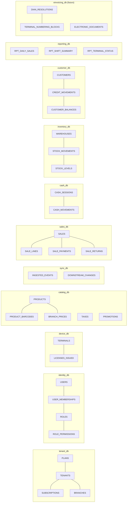
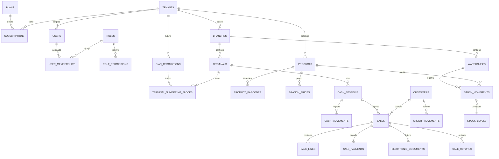

# 02 — Modelo de Datos

DDL completo (patrón **database-per-service**):

| Servicio | Archivo |
|---|---|
| Común (funciones RLS, outbox, inbox) — se aplica en cada BD | [db/cloud/000_common.sql](../db/cloud/000_common.sql) |
| tenant-service | [db/cloud/tenant-service/001_schema.sql](../db/cloud/tenant-service/001_schema.sql) |
| identity-service | [db/cloud/identity-service/001_schema.sql](../db/cloud/identity-service/001_schema.sql) |
| device-service | [db/cloud/device-service/001_schema.sql](../db/cloud/device-service/001_schema.sql) |
| catalog-service | [db/cloud/catalog-service/001_schema.sql](../db/cloud/catalog-service/001_schema.sql) |
| sync-service | [db/cloud/sync-service/001_schema.sql](../db/cloud/sync-service/001_schema.sql) |
| sales-service | [db/cloud/sales-service/001_schema.sql](../db/cloud/sales-service/001_schema.sql) |
| cash-service | [db/cloud/cash-service/001_schema.sql](../db/cloud/cash-service/001_schema.sql) |
| inventory-service | [db/cloud/inventory-service/001_schema.sql](../db/cloud/inventory-service/001_schema.sql) |
| customer-service | [db/cloud/customer-service/001_schema.sql](../db/cloud/customer-service/001_schema.sql) |
| reporting-service | [db/cloud/reporting-service/001_schema.sql](../db/cloud/reporting-service/001_schema.sql) |
| audit-service | [db/cloud/audit-service/001_schema.sql](../db/cloud/audit-service/001_schema.sql) |
| notification-service | [db/cloud/notification-service/001_schema.sql](../db/cloud/notification-service/001_schema.sql) |
| einvoicing-service (**futuro**) | [db/cloud/einvoicing-service/001_schema.sql](../db/cloud/einvoicing-service/001_schema.sql) |
| App Instalable (SQLite) | [db/local/001_schema.sql](../db/local/001_schema.sql) |
| Planes, cobros y mora (tenant-service) | [db/cloud/tenant-service/002_plans_billing.sql](../db/cloud/tenant-service/002_plans_billing.sql) |
| Roles y permisos (identity-service) | [db/cloud/identity-service/002_roles_permissions_seed.sql](../db/cloud/identity-service/002_roles_permissions_seed.sql) |
| Licencias de la Edición Local (device-service) | [db/cloud/device-service/002_local_licenses.sql](../db/cloud/device-service/002_local_licenses.sql) |
| Edición Local (SQLite) | [db/local/002_local_edition.sql](../db/local/002_local_edition.sql) |

## 1. Convenciones

| Tema | Regla |
|---|---|
| Identificadores | **UUIDv7** (ordenables por tiempo, generables offline, sin colisiones). Nunca autoincrementales en entidades creadas en terminal |
| Tenant | `tenant_id` en toda tabla de negocio, primera columna de índices compuestos |
| Dinero | Nube: `NUMERIC(14,2)`. Terminal: `INTEGER` en centavos. Prohibido `float/double` |
| Cantidades | `NUMERIC(14,3)` (nube) / milésimas `INTEGER` (terminal) para productos por peso |
| Fechas | `timestamptz` en UTC; presentación en `America/Bogota` (sin horario de verano) |
| Borrado | Lógico (`deleted_at`) en catálogos para propagar *tombstones* a terminales. Las transacciones (ventas, movimientos) **jamás** se borran ni se editan: se compensan |
| Versionado de fila | `row_xid xid8` actualizado por trigger → cursor de bajada (ver [03](03-sincronizacion-offline.md)) |
| Snapshots | Las líneas de venta guardan nombre, precio e impuestos aplicados en el momento (no dependen del catálogo futuro) |
| Fronteras | **Sin claves foráneas entre servicios**; solo IDs. Integridad entre servicios por eventos y validación en consumidores (cuarentena si falta una referencia) |
| Campos fiscales | `fiscal_*` y `cude` existen pero son `NULL` mientras `fiscal_mode = NONE` (preparado para el módulo futuro) |

## 2. Propiedad de los datos por servicio

## 3. Diagrama entidad-relación lógico (las relaciones entre servicios son por ID, no FK)

## 4. Multi-tenancy con Row-Level Security

Se aplica en **cada** base de datos de servicio:

1. El gateway valida el token y propaga `tenant_id` (claim firmado, nunca de un parámetro del cliente). En eventos de Kafka, `tenant_id` viaja en el sobre del evento.
2. El servicio abre transacción y ejecuta `SET LOCAL app.tenant_id = '<uuid>'` (también en los consumidores, por cada mensaje).
3. Las políticas RLS (`tenant_id = app.current_tenant()`) filtran **toda** lectura y escritura.
4. El rol de conexión de la aplicación es `NOBYPASSRLS` y no es dueño de las tablas (`FORCE ROW LEVEL SECURITY`).
5. PgBouncer en modo *transaction*: por eso se usa `SET LOCAL` (vive solo en la transacción).
6. Pruebas automáticas de aislamiento: suite que intenta leer/escribir datos de otro tenant en cada endpoint y debe fallar.

Defensa en profundidad: aunque haya un bug en un `WHERE`, la base de datos no devuelve filas de otro tenant.

## 5. Tablas proyección vs. tablas fuente

| Fuente (inmutable, append-only) | Proyección (derivada, recalculable) | Servicio |
|---|---|---|
| `ingested_events` | Todo lo demás (se puede re-publicar) | sync |
| `stock_movements` | `stock_levels` | inventory |
| `credit_movements` | `customer_balances` | customer |
| `sales`, `sale_lines`, `sale_payments` | `rpt_daily_sales`, `rpt_hourly_sales`, `rpt_product_sales_daily` | reporting |
| `cash_sessions`, `cash_movements` | `rpt_shift_summary` | reporting |
| Eventos de catálogo/usuarios/clientes | `downstream_changes` (bajada a cajas) | sync |
| `audit_log` | Panel de auditoría | audit |

Las proyecciones se reconstruyen reproduciendo los tópicos de Kafka (retención larga / *tiered storage*) o re-publicando desde `ingested_events`.

## 6. Particionamiento y retención

| Tabla | Partición | Retención en caliente | Archivo |
|---|---|---|---|
| `ingested_events` | Mensual por `received_at` | 24 meses | Parquet en S3 ≥ 10 años |
| `sales`, `sale_lines` | Mensual por `issued_at` | 24 meses | Parquet en S3 (Glacier) ≥ 10 años |
| `stock_movements` | Mensual por `occurred_at` | 24 meses | Igual + snapshot de saldos al cierre |
| `audit_log` | Mensual | 12 meses | S3 Object Lock (WORM) |
| `inbox` (todos los servicios) | TTL 180 días | 180 días | No requerido |
| XML/respuestas DIAN (**futuro**) | — | S3 Standard 1 año | S3 Glacier con Object Lock ≥ 10 años |

Herramienta: `pg_partman` con `premake = 3`.

## 7. Índices críticos

- `downstream_changes (tenant_id, stream, row_xid)` → bajada incremental a cajas.
- `product_barcodes (tenant_id, barcode) WHERE deleted_at IS NULL` único → evita códigos duplicados.
- `sales (tenant_id, branch_id, issued_at DESC)` y `rpt_daily_sales` PK → reportes.
- `event_ids (terminal_id, terminal_seq)` único → detección de huecos y orden.
- `outbox (id) WHERE published_at IS NULL` en cada servicio → relay eficiente.

## 8. Base local de la App Instalable

- Solo contiene datos de **su tenant y su sucursal**: catálogo con precio de la sucursal ya resuelto, usuarios con acceso a la sucursal (hash de PIN), clientes con fiado habilitado (o todos si son < 50k), consecutivo interno de la caja y configuración. **Solo lo necesario para operar la caja offline**; no guarda caché de reportes ni datos de administración.
- Cifrada con SQLCipher (AES-256). La clave se genera al enrolar y se guarda en el keystore del SO (Windows DPAPI/TPM, Android Keystore).
- Tamaño esperado: < 200 MB para 50.000 productos y 1 año de ventas locales (se purgan ventas sincronizadas > 90 días y de turnos cerrados).
- Migraciones versionadas (`schema_version`) aplicadas por el núcleo Rust al arrancar, dentro de transacción y con respaldo previo.

## 9. Datos de referencia de Colombia (semillas)

- Tipos de documento de identidad (CC, CE, NIT, PA, PPT, TI…).
- Códigos DANE de departamentos y municipios.
- Tarifas de impuestos (IVA 19 %, 5 %, exento, excluido, INC, bolsas).
- Denominaciones de billetes y monedas COP para el arqueo.
- **Futuro (módulo fiscal):** responsabilidades fiscales, códigos de tributos, unidades UNECE y medios de pago según el **Anexo Técnico DIAN** vigente. Los campos `dian_code` ya existen en `taxes` para mapearlos sin migración disruptiva.
