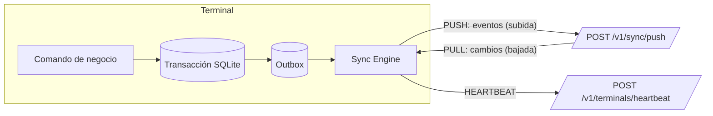

# 03 — Sincronización Offline-First

## 1. Visión general



Tres flujos independientes, cada uno con su propio circuit breaker:

| Flujo | Dirección | Frecuencia | Prioridad |
|---|---|---|---|
| **Push** | Terminal → Nube | Inmediato tras cada venta (debounce 2 s) + cada 30 s | Alta |
| **Pull** | Nube → Terminal | Cada 60 s, al recibir señal de "hay cambios" en el heartbeat, y al iniciar turno | Media |
| **Heartbeat** | Bidireccional | Cada 60 s | Baja (ligero) |

## 2. Escritura atómica local

Al presionar **Cobrar**, el núcleo ejecuta en **una sola transacción SQLite**:

1. Validar sesión de caja abierta, licencia vigente, permisos del cajero.
2. Tomar el siguiente consecutivo interno de la caja (`device_state.next_receipt_number++` → `C01-000123`). Con el módulo fiscal futuro, la `NumberingStrategy` tomará el número del bloque DIAN.
3. Calcular totales, impuestos y redondeo (motor de impuestos determinístico compartido).
4. `FiscalDocumentStrategy`: hoy `NoFiscal` (no hace nada); en el futuro calculará CUDE y QR.
5. Insertar `sales`, `sale_lines`, `sale_payments`.
6. Insertar `local_stock_movements` (delta negativo por línea, considerando `pack_qty`).
7. Si es fiado: insertar `local_credit_movements`.
8. Insertar evento `sale.completed` en `outbox` con `terminal_seq = next_terminal_seq++`.
9. Insertar `local_audit` encadenado.
10. `COMMIT` → recién entonces imprimir el ticket y abrir el cajón.

Si algo falla antes del commit, nada queda registrado (no se consume número). Si la impresora falla después del commit, la venta existe y se ofrece **reimpresión** (auditada).

## 3. Sobre del evento (envelope)

```json
{
  "event_id": "0192a8d4-7c1e-7a3b-9f10-5b2d1e6c4a77",
  "event_type": "sale.completed",
  "schema_version": 1,
  "tenant_id": "…",
  "branch_id": "…",
  "terminal_id": "…",
  "terminal_seq": 15234,
  "occurred_at": "2026-10-03T15:21:09.412-05:00",
  "hlc": "1759522869412:0003:terminal-id",
  "actor_id": "…",
  "payload": { "...": "agregado completo de la venta" },
  "payload_hash": "sha256:…"
}
```

- `event_id`: llave de idempotencia (UUIDv7).
- `terminal_seq`: secuencia monotónica sin huecos por terminal → orden y detección de pérdidas.
- `hlc` (Hybrid Logical Clock): ordena eventos aunque el reloj de la terminal esté desfasado.
- `payload_hash`: detecta reenvíos del mismo `event_id` con contenido distinto (corrupción o manipulación).

### Catálogo de eventos (subida)

| Evento | Servicios consumidores |
|---|---|
| `cash.session.opened` / `cash.session.closed` / `cash.session.reopened` | cash, reporting, audit |
| `cash.movement.recorded` | cash, reporting |
| `sale.completed` | sales, inventory (deltas), cash (pagos en efectivo), customer (fiado), reporting · *futuro: einvoicing* |
| `sale.voided` / `sale.returned` | sales, inventory, cash, customer, reporting, audit · *futuro: einvoicing (nota crédito)* |
| `credit.payment.received` | customer, cash, reporting |
| `customer.created` / `customer.updated` | customer (alta rápida en caja para poder fiar) |
| `audit.recorded` | audit (reimpresiones, apertura manual de cajón, ítems eliminados, PIN fallidos, artículos genéricos vendidos) |

Alcance offline: **solo operaciones de caja**. Recepciones, ajustes, conteos de inventario, catálogo, precios y usuarios se hacen en la App de Gestión (online, síncrono contra el servicio dueño) y llegan a la caja por el pull. Un producto no encontrado se vende con el producto de sistema **"Artículo genérico"** (`track_stock = false`, descripción libre en la línea), que aparece en la App de Gestión como pendiente de crear.

## 4. Protocolo PUSH (caja → sync-service → Kafka → servicios)

```mermaid
sequenceDiagram
    participant SE as Sync Engine (caja)
    participant SY as sync-service
    participant DB as sync_db
    participant K as Kafka pos.events
    participant C as Servicios consumidores
    SE->>SE: Seleccionar PENDING ordenados por terminal_seq (≤200 ó ≤1MB)
    SE->>SE: Marcar IN_FLIGHT, comprimir gzip, firmar con llave del dispositivo
    SE->>SY: POST /v1/sync/push
    SY->>SY: Validar firma, esquema, tenant/terminal del token
    SY->>DB: BEGIN
    loop por evento en orden
        SY->>DB: INSERT event_ids ON CONFLICT (event_id) DO NOTHING
        alt nuevo
            SY->>DB: INSERT ingested_events + INSERT outbox
        else existe y hash igual
            SY-->>SY: DUPLICATE (ok)
        else existe y hash distinto
            SY-->>SY: CONFLICT (alerta de seguridad)
        end
    end
    SY->>DB: UPDATE terminal_seq_state; COMMIT
    SY-->>SE: 200 { results, ack_up_to_seq, server_time }
    SE->>SE: Marcar SENT los ACCEPTED/DUPLICATE
    DB-->>K: relay outbox (key = terminal_id)
    K->>C: cada servicio consume con inbox (idempotente)
```

Reglas:

1. **Idempotencia en la ingesta**: `event_ids.event_id` es PK; registrar el ID, guardar el evento y escribir el outbox ocurren en la **misma transacción**.
2. **Idempotencia en consumidores**: cada servicio inserta `(event_id, consumer)` en su tabla `inbox` en la misma transacción que aplica el efecto. Kafka entrega *al menos una vez*; el inbox lo convierte en *exactamente una vez efectivo*.
3. **Orden**: `sync-service` valida `terminal_seq` contiguo (si llega `N+2` sin `N+1` → `409 GAP_DETECTED` con `expected_seq`). Kafka preserva el orden por partición con `key = terminal_id`.
4. **ACK temprano**: la caja recibe confirmación cuando el evento es durable en `sync_db`; no espera a los consumidores. Si `inventory-service` está caído, el evento espera en Kafka y la caja sigue liberando su outbox.
5. **Rechazos de negocio no bloquean**: si un consumidor no puede aplicar un evento (p. ej. producto inexistente), lo envía a su **DLQ** y registra en `sync_quarantine` (vía evento `sync.quarantined`) para resolución manual en la App de Gestión; continúa con los siguientes. Solo errores de **esquema/firma** devuelven `REJECTED` a la caja.
6. **Sin pérdida**: la caja nunca borra un evento hasta recibir confirmación; un evento `IN_FLIGHT` por más de 2 min vuelve a `PENDING`.
7. **Contrapresión**: si la nube responde `429`/`503` con `Retry-After`, la caja respeta ese tiempo.
8. **Reprocesamiento**: `ingested_events` permite re-publicar eventos a un servicio nuevo o reconstruir proyecciones (p. ej. al activar `einvoicing-service` en el futuro).

## 5. Inventario por deltas

```text
Caja 1 (offline): vende 2 Gaseosa → movimiento -2
Caja 2 (offline): vende 3 Gaseosa → movimiento -3
Stock en nube antes: 4
Al sincronizar:   4 + (-2) + (-3) = -1   → stock negativo → alerta "conteo requerido"
```

- La nube **nunca** recibe "stock = X" desde una caja; solo deltas.
- `stock_levels` se actualiza con `UPDATE ... SET on_hand = on_hand + delta` (conmutativo: el orden de llegada no importa).
- Los conteos físicos se registran como `COUNT_CORRECTION` = (contado − teórico al momento del conteo), calculado en la nube con el teórico a la fecha del conteo para no pisar ventas posteriores.
- Stock local mostrado en caja = `stock_snapshot` (de la nube) + Σ `local_stock_movements` no sincronizados. Es **informativo**; por defecto no bloquea la venta (`allow_negative_stock`).

## 6. Cartera (fiados) offline

Riesgo: dos cajas offline pueden prestarle al mismo cliente por encima del cupo.

Estrategia configurable por tenant:

| Modo | Comportamiento |
|---|---|
| `SOFT` (por defecto) | Saldo local = saldo nube + movimientos locales. Si supera el cupo, pide **autorización de supervisor**. La nube recalcula y alerta si se excedió |
| `ALLOCATED` | El cupo disponible se reparte entre cajas (p. ej. cliente con cupo 300.000 en 3 cajas → 100.000 cada una); se rebalancea al sincronizar |
| `ONLINE_ONLY` | Fiado solo con conexión; offline se rechaza |

## 7. Protocolo PULL (bajada incremental)

El documento de negocio propone marca de tiempo; se **mejora** usando el identificador de transacción de PostgreSQL para no perder filas:

> Con `updated_at`, una transacción larga que empezó antes pero hace commit después del pull deja filas con un timestamp "viejo" que el cliente ya pasó. Con `xid8` + `pg_snapshot_xmin` eso no ocurre.

Con microservicios, la caja **no** consulta las BD de catálogo, identidad o clientes. `sync-service` mantiene un **modelo de bajada** (`downstream_changes`) alimentado por los eventos `catalog.*`, `user.*`, `customer.*`, `inventory.level_changed` y `tenant.*`. Cada evento llega con `source_version` (versión de la entidad en su servicio dueño) y se descarta si es más viejo que lo guardado (eventos fuera de orden).

Algoritmo en `sync-service`:

```sql
-- cursor recibido = :since (xid8, '0' la primera vez)
SELECT pg_snapshot_xmin(pg_current_snapshot()) AS safe_upto;   -- toda tx < safe_upto ya terminó
SELECT entity, entity_id, op, data FROM downstream_changes
 WHERE tenant_id = app.current_tenant()
   AND stream = :stream
   AND (branch_id IS NULL OR branch_id = :terminal_branch)
   AND row_xid >= :since AND row_xid < :safe_upto
 ORDER BY row_xid
 LIMIT 1000;
-- nuevo cursor = safe_upto (o el último row_xid + continuar si hay más páginas)
```

- Respuesta paginada por *stream* (`catalog`, `prices`, `promotions`, `taxes`, `users`, `customers`, `config`, `stock_snapshot`; `numbering` solo con módulo fiscal futuro).
- Incluye *tombstones* (`deleted_at` no nulo) para que la terminal elimine/oculte.
- La terminal aplica cada página en una transacción con **upsert** idempotente y solo entonces guarda el nuevo cursor.
- Primera carga (*bootstrap*): snapshot completo comprimido descargado desde S3 con URL prefirmada (catálogos grandes), luego incremental.
- Si el cursor es demasiado antiguo (datos archivados) la nube responde `410 RESYNC_REQUIRED` → bootstrap.

### Cambios de precio durante offline

- La venta guarda el **precio aplicado** (snapshot). La nube **no** recalcula ventas pasadas.
- Los precios pueden programarse con `valid_from` futuro y bajarse por adelantado, para que una caja offline aplique el cambio a la hora correcta.

## 8. Heartbeat

`POST /v1/terminals/heartbeat` (atendido por `device-service`) cada 60 s con: versión de app, `pending_outbox`, `oldest_pending_at`, último `terminal_seq`, estado de impresora, espacio libre en disco, hora local. Respuesta: hora del servidor, licencia renovada, banderas (`pull_now`, `update_available`, `revoked`), mensajes al cajero. `device-service` publica `terminal.heartbeat` (muestreado) para que `reporting-service` alimente el estado de cajas.

En reportes (App Instalable y App de Gestión): verde (< 5 min), amarillo (5 min–2 h), rojo (> 2 h), gris (> 24 h o con eventos pendientes > 24 h).

## 9. Motor de sincronización (cliente) — política de reintentos

```text
estado_circuito ∈ {CERRADO, ABIERTO, SEMI_ABIERTO}
- CERRADO: envía normalmente. 5 fallos consecutivos (timeout, 5xx, DNS) → ABIERTO
- ABIERTO: no intenta; espera backoff = min(5 min, 2^n · 2 s) + jitter aleatorio ±30 %
- SEMI_ABIERTO: 1 solicitud de prueba (heartbeat). Éxito → CERRADO; fallo → ABIERTO (n+1)
Timeouts: conexión 5 s, lectura 30 s.
Los errores 4xx de negocio NO abren el circuito.
```

El jitter evita la "estampida" cuando vuelve internet en un centro comercial completo o tras una caída de la nube.

## 10. Relojes y tiempo

- La terminal guarda `max_seen_local_time`; si la hora del SO retrocede más de 5 min, se bloquea el cobro hasta que un supervisor confirme y se registra auditoría (evita manipular fechas de ventas o extender la licencia).
- Cada respuesta de la nube trae `server_time`; la terminal calcula el desfase y lo envía en los eventos (`clock_skew_ms`). La nube guarda `issued_at` (hora local declarada) y `received_at` (hora del servidor).
- HLC para ordenar eventos de la misma terminal de forma robusta.

## 11. Versionado del protocolo

- `schema_version` por tipo de evento; la nube soporta N y N-1 al menos 6 meses.
- Endpoint `/v1/` con evolución aditiva; cambios incompatibles → `/v2/`.
- La terminal envía `X-App-Version`; si es menor que la mínima soportada → `426 Upgrade Required` (sigue vendiendo offline; muestra aviso de actualización).
