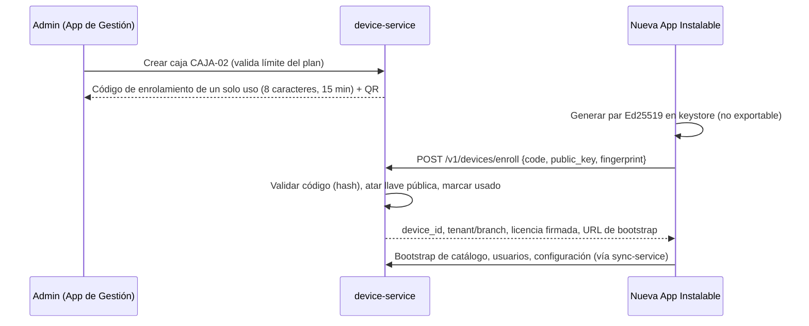
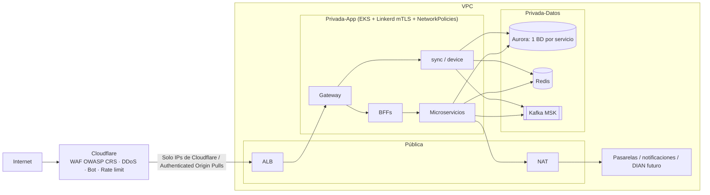

# 04 — Seguridad

## 1. Modelo de amenazas (resumen STRIDE)

| Amenaza | Ejemplo | Control |
|---|---|---|
| Suplantación | Terminal clonada envía ventas falsas | Llave Ed25519 por dispositivo en keystore/TPM, firma de lotes, revocación |
| Manipulación | Cajero edita SQLite para borrar ventas | SQLCipher, `terminal_seq` sin huecos, cadena de hash en auditoría, consecutivo interno sin huecos por caja |
| Repudio | "Yo no anulé esa venta" | PIN individual + aprobación de supervisor + `audit_log` encadenado e inmutable |
| Divulgación | Fuga de datos entre tenants | RLS, claims firmados, pruebas de aislamiento, cifrado en reposo |
| Denegación de servicio | Ráfaga de requests | Cloudflare, rate limit por tenant/terminal/IP, colas, autoescalado |
| Elevación de privilegios | Cajero aprueba su propio descuento | RBAC con permisos atómicos, regla "aprobador ≠ solicitante" |

## 2. Autenticación por canal

| Actor | Canal | Mecanismo |
|---|---|---|
| Super Admin | Consola interna | OIDC + **MFA obligatorio (WebAuthn/TOTP)**, IP allow-list, sesiones de 30 min, acceso *just-in-time* a datos de tenant con justificación auditada |
| Dueño / Admin | App de Gestión (web + móvil) | OIDC (Authorization Code + PKCE), MFA obligatorio para dueño, refresh token rotativo con detección de reutilización; token `aud=mgmt-app`; **step-up MFA** para acciones sensibles (precios masivos, permisos, revocar caja, castigar cartera) |
| Admin / Supervisor | App Instalable — Reportes de la sucursal | PIN del usuario + token de la caja; `bff-pos` limita los datos a la sucursal de la caja y verifica `reports.view` del usuario |
| Supervisor / Cajero | App Instalable — módulo Ventas | **PIN** 4–6 dígitos verificado **localmente** (offline) |
| Caja (máquina) | `/sync`, `/terminals` | Token de dispositivo de corta vida (15 min) obtenido con **aserción firmada por la llave privada del dispositivo** (`private_key_jwt`, RFC 7523) |
| Servicio a servicio | Interno | **mTLS** del service mesh (identidad SPIFFE por servicio) + políticas de autorización (quién puede llamar a quién) |
| Integraciones | Webhooks | HMAC-SHA256 con secreto por integración + timestamp anti-replay |

### 2.1 PIN offline

- Hash **Argon2id** (m=64 MB, t=3, p=1) con sal única, calculado en la nube y bajado a la terminal; el PIN en claro nunca viaja ni se guarda.
- 5 intentos fallidos → bloqueo 5 min progresivo; 10 → bloqueo hasta desbloqueo por supervisor o nube. Cada intento fallido genera `audit.recorded`.
- PIN triviales prohibidos (1234, 0000, fecha de nacimiento, repetidos).
- Cambio de PIN obligatorio en el primer uso y forzable desde la App de Gestión.
- Al revocar un usuario, se propaga en el siguiente pull; además, la licencia de dispositivo incluye `users_version` para forzar pull antes de permitir login si hay conexión.

### 2.2 Enrolamiento de terminal



- **Tenant nuevo**: el registro del negocio se hace en la App de Gestión (web o móvil) con email verificado + MFA del dueño; al terminar, el asistente crea `CAJA-01` y muestra su código/QR de enrolamiento para la App Instalable.
- Revocación remota: `terminals.status = REVOKED` → el siguiente heartbeat ordena bloqueo y borrado seguro de la clave local de la base de datos (tras intentar subir el outbox).
- Reemplazo de equipo: nuevo enrolamiento; la caja anterior se retira cuando su outbox está vacío o se declara pérdida.

### 2.3 Licencia y gracia offline

Token JWT firmado con Ed25519 por la nube (la llave privada vive en KMS):

```json
{ "sub":"terminal-id","tid":"tenant-id","plan":"NEGOCIO","features":["credit","promotions"],
  "status":"ACTIVE","iat":1759522869,"exp":1760386869,"grace_days":10,"users_version":42 }
```

- `exp` = mínimo(fecha pagada + 15 días, última validación + días de gracia offline del plan). Así una caja sin internet también se bloquea por falta de pago (ver [10 §3](10-roles-planes-licenciamiento.md)).
- Si `status = SUSPENDED`, la caja no permite abrir turnos nuevos (sí cerrar el actual y sincronizar).
- La terminal verifica la firma con la llave pública embebida en la app (rotación soportada mediante `kid`).
- Avisos al cajero a partir del 50 % de la gracia; al expirar → **modo solo lectura** (consultas, reimpresión, cierre de turno y **subida del outbox sí permitidos**; nuevas ventas no).
- Protección contra retroceso de reloj (ver [03 §10](03-sincronizacion-offline.md)).

## 3. Autorización (RBAC + ABAC)

Modelo de roles, matriz completa de permisos y roles habilitados por plan: ver **[10 — Roles, planes y licenciamiento](10-roles-planes-licenciamiento.md)**. Seeds en [db/cloud/identity-service/002_roles_permissions_seed.sql](../db/cloud/identity-service/002_roles_permissions_seed.sql).

Permisos atómicos; los roles son paquetes de permisos (personalizables en el plan Multi-tienda). Además del rol, se evalúan atributos: sucursal asignada, monto, hora y **entitlements del plan**. Resumen:

| Permiso | Cajero | Supervisor | Admin sucursal | Dueño |
|---|:-:|:-:|:-:|:-:|
| `sale.create` | ✔ | ✔ | ✔ | ✔ |
| `sale.discount.line` (≤ X %) | ✔ | ✔ | ✔ | ✔ |
| `sale.discount.extraordinary` | — | ✔ | ✔ | ✔ |
| `sale.price.override` | — | ✔ | ✔ | ✔ |
| `cart.item.remove_after_scan` | ✔ (auditado) | ✔ | ✔ | ✔ |
| `sale.void` / `sale.return` | — | ✔ | ✔ | ✔ |
| `receipt.reprint` | ✔ (auditado) | ✔ | ✔ | ✔ |
| `drawer.open.manual` | — | ✔ | ✔ | ✔ |
| `cash.session.open/close` | ✔ | ✔ | ✔ | ✔ |
| `cash.session.reopen` | — | ✔ | ✔ | ✔ |
| `cash.session.view_expected` | — | — | ✔ | ✔ |
| `cash.movement.out` (> umbral) | — | ✔ | ✔ | ✔ |
| `credit.sale` / exceder cupo | ✔ / — | ✔ / ✔ | ✔ / ✔ | ✔ / ✔ |
| `inventory.adjust` | — | — | ✔ | ✔ |
| `catalog.manage`, `price.manage` | — | — | opcional | ✔ |
| `users.manage`, `terminals.manage` | — | — | sucursal | ✔ |
| `reports.local` (mi turno/mi caja, Instalable) | ✔ | ✔ | ✔ | ✔ |
| `reports.view` (sucursal en Instalable; todo en App de Gestión) | — | opcional | sucursal | ✔ |
| `reports.financial` (márgenes, costos) | — | — | sucursal | ✔ |

La App de Gestión muestra solo las secciones que permiten los permisos del usuario; la autorización real se evalúa en `bff-app` y en cada microservicio (nunca solo en la UI). Los permisos de caja (ventas, turnos, aprobaciones) solo se ejercen en la App Instalable.

**Aprobación en caja**: el supervisor digita su PIN en la terminal del cajero; el evento registra `requested_by` y `approved_by` (deben ser distintos).

Evaluación: en la nube con una librería de políticas (CASL / Cerbos / OPA); en la terminal, con la lista de permisos bajada por usuario, evaluada en el núcleo Rust (no en la UI).

## 4. Protección de datos

| Dónde | Control |
|---|---|
| En tránsito | TLS 1.3 (mínimo 1.2), HSTS, certificate pinning en la App Instalable y en la App de Gestión móvil (llave pública del intermedio, con pin de respaldo) |
| En reposo nube | RDS/S3 cifrados con KMS (CMK), backups cifrados, snapshots no públicos |
| En reposo terminal | SQLCipher AES-256; clave en DPAPI/TPM/Android Keystore |
| Secretos | AWS Secrets Manager; rotación automática de credenciales de BD; nada de secretos en repositorio ni variables de imagen |
| Certificado de firma DIAN (**futuro**) | Solo en la nube (KMS/CloudHSM) o en el proveedor tecnológico; nunca en cajas |
| Entre servicios | mTLS obligatorio (Linkerd); Kafka con TLS + SASL/IAM y ACL por tópico (cada servicio solo produce en sus tópicos) |
| Datos personales | Minimización; cifrado a nivel de campo (pgcrypto/KMS envelope) para teléfono/email si se exige; enmascaramiento en logs |
| Logs | Sin PII ni tokens; `trace_id` para correlación |

## 5. Seguridad de aplicación (OWASP Top 10 / API Top 10)

| Riesgo | Control concreto |
|---|---|
| Broken Access Control / BOLA | RLS + verificación de pertenencia del recurso (branch/terminal) en cada handler; IDs no secuenciales |
| Fallas criptográficas | Algoritmos estándar (Argon2id, Ed25519, AES-GCM, SHA-256/384); sin cripto casera |
| Inyección | ORM/queries parametrizadas; prohibido SQL concatenado (regla de lint); validación Zod en el borde |
| Diseño inseguro | Modelado de amenazas por épica; revisiones de seguridad en PR |
| Mala configuración | IaC revisada, CIS benchmarks, headers de seguridad (CSP estricta, X-Frame-Options, Referrer-Policy), CORS con lista blanca |
| Componentes vulnerables | Dependabot/Renovate, `npm audit`, `cargo audit`, escaneo de imágenes (Trivy), SBOM (CycloneDX) |
| Fallas de autenticación | MFA, rate limit en login, bloqueo progresivo, detección de credenciales filtradas |
| Integridad de software | Commits firmados, builds reproducibles, firma de binarios POS (Authenticode en Windows) y del canal de actualización |
| Logging insuficiente | Auditoría de acciones críticas, alertas SIEM |
| SSRF | Sin fetch de URLs provistas por usuarios; egress controlado por NAT + lista de destinos |
| Consumo de recursos sin límite | Tamaño máximo de body (1 MB sync, 10 MB imports), paginación obligatoria, timeouts |
| Asignación masiva | DTOs explícitos; nunca mapear el body directamente a la entidad |

## 6. Seguridad de red



- Security groups de mínimo privilegio; bases de datos sin IP pública; cada servicio con su propio usuario de BD y acceso solo a su base.
- Kubernetes `NetworkPolicy` *deny-all* por defecto; solo se habilitan los flujos declarados (BFF → servicio, servicio → su BD, servicio → Kafka).
- Acceso administrativo solo vía SSM Session Manager (sin SSH, sin bastión expuesto).
- VPC endpoints para S3, Secrets Manager, KMS.

## 7. Rate limiting (en gateway, respaldado por Redis)

| Clave | Límite inicial |
|---|---|
| IP anónima (login, enrolamiento) | 10/min |
| Caja — `/sync/push` | 60/min, ráfaga 20 |
| Caja — `/sync/pull` | 30/min |
| Instalable — `/pos-reports/*` | 120/min por caja |
| App de Gestión — `/app/*` | 300/min por usuario; importaciones 5/min |
| Tenant (agregado) | según plan |

Respuesta `429` con `Retry-After`.

## 8. Auditoría inmutable

- `audit_log` append-only: el rol de la app solo tiene `INSERT`/`SELECT`.
- Cada registro incluye `hash = SHA-256(prev_hash || contenido)` por tenant → cualquier alteración rompe la cadena (verificación nocturna).
- Exportación diaria a S3 con Object Lock (modo compliance).
- Acciones auditadas mínimas: anulaciones, devoluciones, reimpresiones, apertura manual de cajón, eliminación de ítems del carrito, descuentos y cambios de precio en caja, reaperturas de turno, ajustes de inventario, cambios de precio/catálogo, cambios de permisos, accesos de soporte, login fallido, cambios de reloj detectados.

## 9. Seguridad del ciclo de desarrollo

- Ramas protegidas, PR con revisión obligatoria, CI con SAST (Semgrep/CodeQL), secret scanning, DAST (OWASP ZAP) en staging.
- Pentest externo antes del lanzamiento y anual.
- Programa de divulgación responsable (`security.txt`).
- Plan de respuesta a incidentes con roles, runbooks y notificación a la SIC según Ley 1581 cuando aplique.
