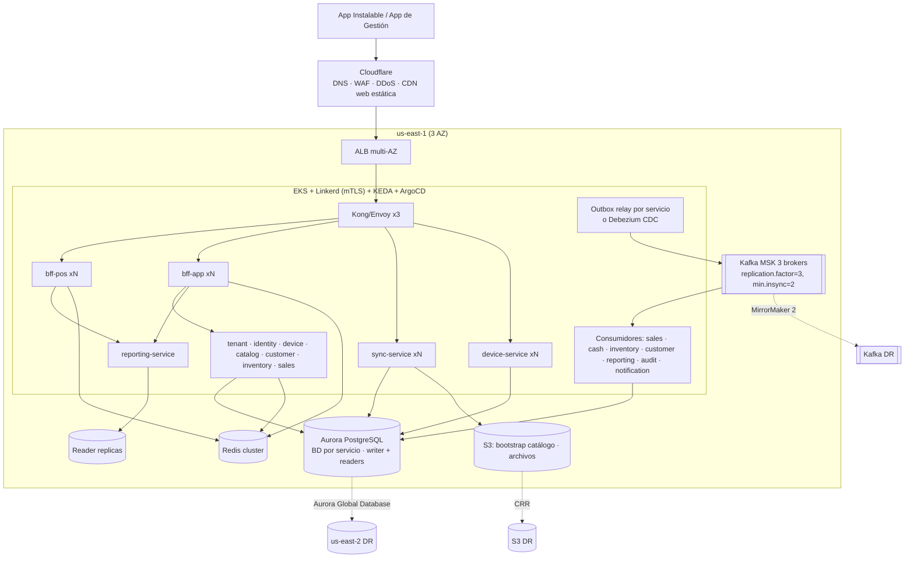
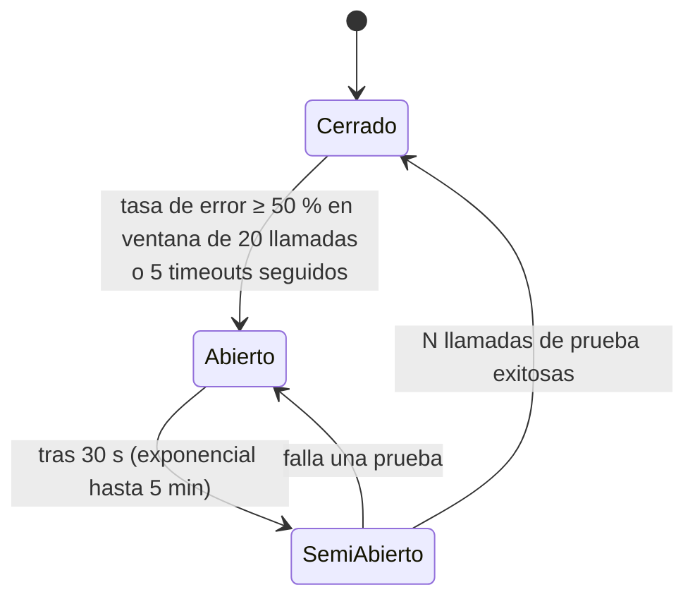

# 05 — Resiliencia, Infraestructura y Operación

## 1. Topología de despliegue (AWS)

- Todo multi-AZ; servicios stateless en EKS con autoescalado: HPA por CPU/latencia para servicios HTTP y **KEDA por lag de Kafka** para consumidores.
- Cada microservicio con su propio *pipeline*, versión y despliegue independiente (Helm chart + ArgoCD).
- Despliegues **canary** (Argo Rollouts: 10 % → 50 % → 100 %) con rollback automático por métricas de error.
- Migraciones de BD **expand → migrate → contract** por servicio.
- `PodDisruptionBudget`, `topologySpreadConstraints` entre AZ y límites de recursos en todos los pods.

## 2. Proxy, Gateway y balanceo

| Capa | Función |
|---|---|
| Cloudflare (reverse proxy de borde) | Terminación TLS, WAF (OWASP CRS), mitigación DDoS L3–L7, bot management, cache de assets de la web, *Authenticated Origin Pulls* |
| ALB | Balanceo L7 multi-AZ, health checks, solo acepta tráfico del borde |
| API Gateway (Kong/Envoy) | Validación JWT (audiencias `pos-device`, `mgmt-app`), rate limiting, límites de tamaño, enrutamiento a BFF/servicio por ruta y versión, `X-Request-Id`, CORS (solo dominio de la App Universal), timeouts por ruta |
| BFF (`bff-pos`, `bff-app`) | Agregación de llamadas a varios servicios, forma de respuesta por front, caché Redis, circuit breakers por servicio destino |
| Service mesh (Linkerd) | mTLS interno, timeouts y retries declarativos, balanceo EWMA por latencia, métricas doradas por ruta |

Timeouts por ruta (gateway → servicio): `/sync/push` 30 s, `/sync/pull` 20 s, `/app/*` 10 s, `/app/reports/*` y `/pos-reports/*` 15 s (exportaciones pesadas: asíncronas a S3).

## 3. Patrones de resiliencia

### 3.1 Circuit breaker

Aplicado a **toda dependencia externa o remota** (en Node: `opossum`; en Rust cliente: implementación propia del sync engine).

| Dependencia | Circuit breaker | Fallback cuando está abierto |
|---|---|---|
| BFF → microservicio (cada uno) | Sí, por servicio destino | Respuesta parcial: el dashboard muestra los widgets disponibles y marca "no disponible" el resto; caché Redis de la última respuesta |
| Servicio → Kafka (relay del outbox) | Sí | El outbox acumula en PG; nada se pierde; alerta si crece |
| Consumidor → su BD | Sí | Pausa el consumo de la partición (no hace commit de offset) y reintenta; KEDA no escala sobre un breaker abierto |
| Pasarela de pagos de suscripción | Sí | Marcar cobro como pendiente; no suspender tenant por falla técnica |
| Email / SMS / WhatsApp / Push | Sí | Cola con reintento; proveedor secundario |
| Redis | Sí | Rate limit degradado en memoria; cache bypass |
| Réplica de lectura (reporting) | Sí | Lectura desde writer con límite estricto, o "datos en actualización" |
| Proveedor tecnológico DIAN (**futuro**) | Sí, por proveedor | Encolar documento y reintentar; alerta antes del plazo legal |
| Nube (desde la App Instalable) | Sí: uno para sync y otro para reportes (ver [03 §9](03-sincronizacion-offline.md)) | Caja 100 % local; reportes muestran "Sin conexión" |
| Nube (desde la App de Gestión) | No aplica modo degradado | Pantalla "Sin conexión" / "Servicio no disponible" con reintento; nunca guarda cambios localmente |

### 3.2 Otros patrones

| Patrón | Uso |
|---|---|
| **Timeout** | En toda llamada saliente; nunca esperas infinitas |
| **Retry con backoff exponencial + jitter** | Solo en operaciones idempotentes; máximo 3 en línea, el resto vía cola |
| **Bulkhead** | Servicios, pools de conexión y *consumer groups* separados: la ingesta de cajas no comparte recursos con reportes ni con notificaciones |
| **Transactional Outbox** | En cada servicio: cambio de estado + evento en la misma transacción; relay (o Debezium) publica a Kafka |
| **Idempotent Consumer (Inbox)** | Cada consumidor registra `(event_id, consumer)` en su BD en la misma transacción del efecto |
| **Saga orquestada** | Onboarding de tenant (tenant → identity → sucursal → caja), cambio de plan; con pasos compensatorios y estado persistido |
| **Dead Letter Topic** | Tras N reintentos (topic `*.retry` con backoff → `*.dlt`), alerta y herramienta de reproceso |
| **Load shedding** | Si la BD de un servicio se satura, el gateway prioriza `/sync/push` y heartbeats sobre `/reports` (503 con `Retry-After`) |
| **Graceful degradation** | Reportes muestran "última actualización hace X" en vez de fallar |
| **Health checks** | `/health/live` y `/health/ready` separados; readiness no depende de servicios hermanos (evita fallos en cascada) |
| **Feature flags** | Activación por tenant (Unleash/GrowthBook); el módulo de facturación electrónica se encenderá así |

## 4. Mensajería (Kafka)

| Tópico | Clave | Productor | Consumidores |
|---|---|---|---|
| `pos.events` | `terminal_id` | sync-service | sales, cash, inventory, customer, reporting, audit |
| `catalog.events` | `tenant_id` | catalog-service | sync (bajada), reporting (dimensiones), inventory |
| `identity.events` | `tenant_id` | identity-service | sync (usuarios/PIN), reporting |
| `tenant.events` | `tenant_id` | tenant-service | device, identity, sync, reporting |
| `device.events` | `terminal_id` | device-service | reporting, notification |
| `sales.events` | `tenant_id` | sales-service | reporting, notification · *futuro: einvoicing* |
| `inventory.events` | `tenant_id` | inventory-service | sync (stock_snapshot), reporting, notification |
| `customer.events` | `tenant_id` | customer-service | sync, reporting, notification |
| `cash.events` | `tenant_id` | cash-service | reporting, notification |
| `<topic>.retry` / `<topic>.dlt` | — | consumidores | operación / soporte |

- Esquemas en **Schema Registry** (JSON Schema/Avro) con compatibilidad `BACKWARD`.
- Retención: 7 días en caliente + *tiered storage* 1 año para `pos.events` (reconstrucción de proyecciones).
- Productores con `acks=all` e idempotencia habilitada.

## 5. Observabilidad

| Señal | Herramienta | Ejemplos |
|---|---|---|
| Trazas | OpenTelemetry → Tempo | Traza distribuida caja → sync-service → Kafka (contexto propagado en headers) → cada consumidor |
| Métricas | Prometheus/Mimir + Grafana | RED por servicio, **lag por consumer group**, tamaño de outbox por servicio, conexiones BD |
| Logs | JSON estructurado → Loki | Con `trace_id`, `tenant_id`, `terminal_id`, `service`; sin PII |
| Errores | Sentry (servicios, App Instalable, App de Gestión) | Incluye versión de la app |
| Telemetría POS | Heartbeat | Outbox pendiente, edad del evento más antiguo, impresora, disco |

### Métricas de negocio clave

- `pos_outbox_oldest_pending_seconds` por terminal (alerta > 24 h).
- `sync_push_events_total{status}` (APPLIED/DUPLICATE/QUARANTINED/REJECTED).
- `sync_gap_detected_total`.
- `kafka_consumer_lag{group}` (alerta si `pos.events` > 5 min de atraso).
- `outbox_unpublished_rows{service}`.
- `dlt_messages_total{topic}` (> 0 genera ticket).
- `stock_negative_products_total` por sucursal.
- `cash_session_difference_abs` (descuadres atípicos).

## 6. SLO / SLA

| Servicio | SLO | Nota |
|---|---|---|
| Cobro en terminal | 100 % disponible (no depende de la nube) | p95 < 300 ms de "Cobrar" a impresión |
| `/sync/push` | 99,9 % mensual, p99 < 800 ms | |
| App de Gestión (`bff-app`) / reportes de caja (`bff-pos`) | 99,9 % mensual | Sin modo offline: su disponibilidad la define la nube |
| Frescura de reportes | 95 % de ventas visibles < 60 s desde que la caja tiene red | Depende del lag de consumidores |

Presupuesto de errores: si se consume > 50 % en el mes, se congelan despliegues de funcionalidades y se prioriza estabilidad.

## 7. Backups y recuperación ante desastres

| Elemento | Estrategia | RPO | RTO |
|---|---|---|---|
| Aurora (todas las BD) | Multi-AZ + PITR (7–35 días) + Aurora Global Database | ≈ 0 (AZ) / < 1 min (región) | < 5 min (AZ) / < 1 h (región) |
| S3 | Versionado + replicación cross-region | ≈ 0 | < 1 h |
| Redis | Reconstruible (no es fuente de verdad) | n/a | minutos |
| Kafka | RF=3 multi-AZ; MirrorMaker 2 a DR; los outbox en BD permiten republicar | ≈ 0 | minutos |
| Proyecciones (reporting, sync downstream) | Reconstruibles por replay | n/a | horas |
| Caja | Snapshot cifrado local cada hora; el outbox es la fuente hasta confirmación | último snapshot | reinstalar + restaurar |

Las terminales funcionan como **buffer natural de DR**: si la nube pierde minutos de datos, los eventos no confirmados siguen en el outbox y se reenvían.

Simulacros: restauración de PITR mensual; *game day* de caída de región semestral; chaos testing (matar pods, latencia en PG, broker caído) en staging.

## 8. Entornos y CI/CD

| Entorno | Propósito |
|---|---|
| `local` | Docker Compose / Tilt (Postgres, Redis, Redpanda, Keycloak, MinIO) levantando solo los servicios necesarios |
| `dev` | Integración continua |
| `staging` | Copia de producción anonimizada |
| `prod` | Producción |

Pipeline por servicio: lint → tests unitarios → **tests de contrato** (eventos contra Schema Registry y APIs con Pact entre BFF y servicios) → tests de integración (Testcontainers con Postgres + Redpanda) → SAST/SCA → build imagen + SBOM + firma (cosign) → ArgoCD staging → E2E (simulador de cajas offline + Playwright para la App de Gestión web) → aprobación → canary prod.

App Instalable: build firmado (Windows MSI/NSIS, Android APK/AAB), canal `beta` (5 % de cajas) → `stable`.
App de Gestión: web desplegada en Cloudflare Pages/S3+CDN; móvil con EAS Build/Submit a tiendas y *OTA updates* (EAS Update) para cambios de JS.

## 9. Pruebas de carga y resiliencia

- k6: simular 15.000 terminales reconectando simultáneamente con 500 eventos pendientes cada una (escenario "volvió la luz en la ciudad").
- Validar que el jitter y los `Retry-After` mantengan la BD bajo 70 % de CPU.
- Pruebas de idempotencia: reenviar el mismo lote 100 veces en paralelo → un solo efecto contable.
- Pruebas de corte de energía en caja (kill -9 durante cobro) → base consistente, sin consecutivos perdidos ni duplicados.
- Chaos testing de microservicios: apagar `inventory-service` 30 min → las cajas siguen sincronizando, el lag crece y al volver se procesa todo sin duplicados.

## 10. Costos (orden de magnitud, fase inicial)

EKS (control plane + 3–6 nodos), Aurora PostgreSQL Multi-AZ (db.r6g.large compartida por BDs de servicio al inicio), MSK Serverless o Redpanda Cloud, ElastiCache pequeño, S3, Cloudflare Pro/Business, Grafana Cloud. Los microservicios elevan el costo fijo frente a un monolito; mitigarlo con nodos Graviton/Spot para consumidores y consolidando BDs de servicio en el mismo clúster hasta que el volumen justifique separarlas. Etiquetas de costo por servicio y métrica de costo por tenant.
