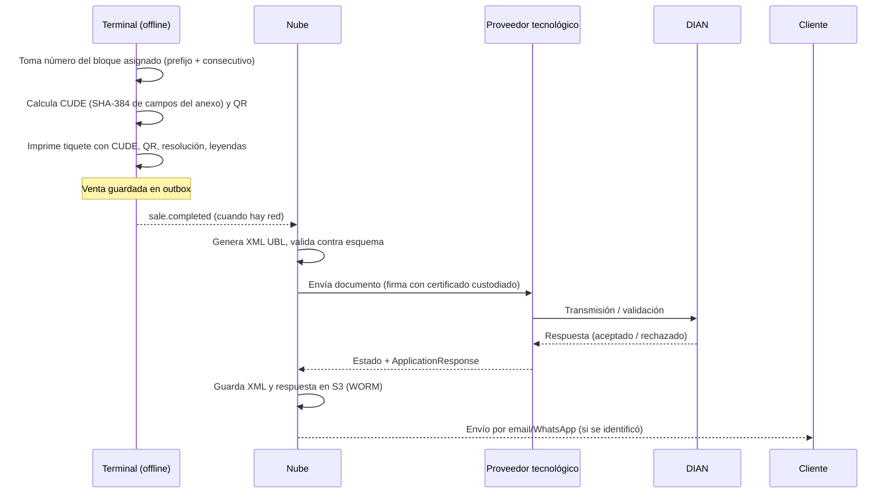

# 06 — Cumplimiento Normativo Colombia

> **Importante:** este documento orienta el diseño técnico. Toda regla tributaria debe ser validada con un contador público / asesor tributario y con el **proveedor tecnológico** habilitado ante la DIAN antes de producción. Los valores (UVT, tarifas, plazos, fechas de calendario) se modelan como **parámetros configurables y versionados**, nunca como constantes en el código.

## 0. Modo fiscal de la fase actual: SIN facturación electrónica

La población objetivo inicial son **tiendas de barrio**, que en su gran mayoría **no están obligadas a facturar electrónicamente** (personas naturales no responsables de IVA que cumplen los topes y condiciones del Estatuto Tributario). Por eso:

| Aspecto | Fase actual (`fiscal_mode = NONE`) |
|---|---|
| Documento entregado al cliente | **Comprobante de venta interno** (no fiscal), con leyenda configurable, p. ej. *"Documento no válido como factura electrónica"* |
| Numeración | Consecutivo interno por caja: `C01-000001`, sin huecos, nunca se reinicia |
| Resolución DIAN, CUDE, QR, XML, proveedor tecnológico | **No aplican** (no se despliega `einvoicing-service`) |
| Impuestos | Se calculan y discriminan igual (para reportes del tendero y por si es responsable de IVA en el futuro) |
| Onboarding | El dueño declara que **no está obligado** a facturar electrónicamente (`not_obligated_declared_at`), con texto de ayuda y recomendación de validar con su contador. Si indica que sí está obligado, se le informa que el módulo estará disponible próximamente (lista de espera) |
| Responsabilidad | Los términos del servicio aclaran que el cumplimiento de la obligación de facturar es del comerciante |

Contenido del comprobante interno: nombre del negocio, documento del dueño (opcional), dirección, caja y cajero, consecutivo, fecha y hora, productos (cantidad, precio, descuento), discriminación de impuestos si aplica, total, medios de pago y cambio, saldo de fiado si aplica, mensaje de pie configurable.

### Qué queda preparado para activar el módulo fiscal sin rediseño

| Capa | Preparación |
|---|---|
| Datos (nube) | `tenants.fiscal_mode`, `sales.fiscal_*`/`cude`, `sale_returns.fiscal_note_*`, `taxes.dian_code`; esquema completo de `einvoicing-service` en [db/cloud/einvoicing-service/001_schema.sql](../db/cloud/einvoicing-service/001_schema.sql) |
| Datos (caja) | `device_state.fiscal_mode`, columnas fiscales en `sales`, tabla `numbering_blocks` |
| Código de la caja | Interfaces `NumberingStrategy` y `FiscalDocumentStrategy` con implementación `Internal`/`NoFiscal` hoy |
| Eventos | `sale.completed` ya incluye todos los datos que necesita un documento UBL (adquirente opcional, impuestos por línea, medios de pago) |
| Arquitectura | `einvoicing-service` será un consumidor más de `sales.events`; no requiere modificar los demás servicios |
| Activación | Feature flag `einvoicing` por plan/tenant + cambio de `fiscal_mode`; las cajas lo reciben en el pull de `config` |
| Histórico | Ventas previas a la activación quedan como comprobantes internos (no se re-emiten) |

---

## 1. Facturación electrónica y documento equivalente POS — MÓDULO FUTURO

> Todo lo descrito en esta sección es el **diseño del módulo futuro**. No se implementa en la fase actual.

### 1.1 Marco

- **Resolución DIAN 000165 de 2023** (y modificatorias): sistema de facturación electrónica y **documentos equivalentes electrónicos**, incluido el *Documento Equivalente Electrónico tiquete de máquina registradora con sistema POS*.
- Anexo técnico vigente (XML UBL 2.1, firma XAdES, CUFE/CUDE, QR, tablas de códigos).
- Resoluciones de numeración autorizadas por la DIAN (prefijo, rango, vigencia) por tipo de documento.

### 1.2 Estrategia de integración

| Opción | Pros | Contras | Recomendación |
|---|---|---|---|
| **A. Proveedor tecnológico** (vía API) | Habilitación más rápida, ellos gestionan firma y DIAN | Costo por documento, dependencia externa | **Fase 1** |
| B. Software propio habilitado ante DIAN | Menor costo marginal, control total | Proceso de habilitación, certificados, set de pruebas, mantenimiento del anexo técnico | Fase 3 (por volumen) |

La integración se implementará dentro de `einvoicing-service` detrás de una interfaz `EInvoicingProvider` (patrón *adapter*) para poder cambiar de proveedor o pasar a software propio, con circuit breaker y cola de reintentos ([05](05-resiliencia-infraestructura.md)).

### 1.3 Flujo técnico offline



Decisiones clave:

1. **CUDE calculado en la terminal** (es un hash de datos de la venta + clave/PIN de software), permitiendo imprimir QR válido sin red. La clave necesaria para el cálculo se entrega a la terminal cifrada y se guarda en SQLCipher. *Validar con el proveedor si el CUDE debe calcularlo él; si es así, la terminal imprime en modo contingencia y la representación gráfica definitiva se envía luego.*
2. **Firma digital en la nube**: el certificado de firma nunca sale de KMS/HSM o del proveedor.
3. **Contingencia**: si la terminal está offline al vender, el documento se trata bajo el régimen de **contingencia** que defina el anexo/proveedor, con transmisión dentro del plazo legal una vez se restablezca la conexión. El sistema:
   - Marca la venta con `contingency=true` y la hora de inicio/fin de la contingencia.
   - Monitorea la edad de documentos no transmitidos y alerta **antes** del vencimiento del plazo.
   - Registra el evento de contingencia para reporte a la DIAN si aplica.
4. **Rechazos DIAN**: la venta **no se borra**. Se corrige y retransmite (errores de datos) o se emite nota crédito / nota de ajuste según corresponda. Panel de "documentos rechazados" con causa y acción.

### 1.4 Numeración por terminal (crítico para offline)

```text
Resolución DIAN: prefijo POS1, rango 1 – 1.000.000, vigente hasta 2028-05-31
  ├── CAJA-01 bloque activo:   1 –  5.000   | bloque en espera: 15.001 – 20.000
  ├── CAJA-02 bloque activo: 5.001 – 10.000 | bloque en espera: 20.001 – 25.000
  └── CAJA-03 bloque activo: 10.001 – 15.000
```

- Cada terminal recibe **un bloque activo y uno de reserva**; al consumir 80 % del activo la nube asigna otro.
- Restricción `EXCLUDE` en PostgreSQL impide bloques solapados.
- La terminal bloquea el cobro si: no tiene números disponibles, la resolución venció, o el prefijo no está habilitado. Alerta desde 20 % restante y 30 días antes del vencimiento de la resolución.
- Consecuencia aceptada: la numeración global no es cronológica entre cajas (permitido cuando cada caja tiene su rango/prefijo; **validar con contador** si conviene un **prefijo por caja** para máxima claridad — opción recomendada para tenants grandes).

### 1.5 Reglas de negocio parametrizables

| Regla | Parámetro |
|---|---|
| Tope en UVT por encima del cual debe expedirse **factura electrónica de venta** en lugar de tiquete POS | `pos_max_uvt` (validar vigencia y valor) |
| Valor de la UVT del año | `uvt_value[year]` |
| Cliente solicita factura (con NIT, para soportar costos/IVA) | Botón "Factura electrónica" → captura datos del adquirente → doc tipo `INVOICE` con su propio bloque |
| Consumidor final | Identificación genérica definida por la DIAN (`222222222222`) |
| Notas crédito | Bloques propios por terminal; referencia obligatoria al documento original |
| Documento soporte (compras a no obligados a facturar) | Generado desde la App de Gestión en recepción de mercancía / pago a proveedor |

### 1.6 Contenido mínimo del tiquete impreso

Razón social y NIT del vendedor, régimen/responsabilidades, resolución DIAN (número, fecha, rango, vigencia), prefijo y número, fecha y hora, identificación del adquirente (o consumidor final), descripción, cantidad, valor unitario, descuentos, discriminación de impuestos por tarifa, total, medios de pago, CUDE, QR, nombre del software y del proveedor tecnológico, caja y cajero. Plantillas versionadas por tenant; validar contra el anexo técnico vigente.

## 2. Impuestos

Motor de impuestos **determinístico y compartido** (mismo código/algoritmo en terminal y nube, con *golden tests* idénticos) para que los totales coincidan al centavo.

| Impuesto | Tipo | Nota |
|---|---|---|
| IVA 19 % | Porcentual | General |
| IVA 5 % | Porcentual | Bienes/servicios específicos |
| Exento (0 %) | Porcentual 0 | Se reporta en XML con tarifa 0 |
| Excluido | Sin impuesto | No se reporta como IVA |
| INC 8 % | Porcentual | Restaurantes, bares, ciertos servicios |
| INC bolsas plásticas | **Valor fijo por unidad** | Valor ajustado anualmente; se modela como producto "Bolsa" con impuesto fijo |
| Impuestos saludables / otros | Configurables | Normalmente los causa el productor/importador; habilitar solo si el tenant lo requiere |

- Precios del catálogo **con impuestos incluidos** (como se exhiben en Colombia, Estatuto del Consumidor); la base se calcula hacia atrás: `base = round(precio / (1 + tarifa))`.
- Política de redondeo documentada (por línea vs. por documento) idéntica en terminal y nube.
- Redondeo de efectivo configurable (p. ej. al múltiplo de $50) registrado en `rounding` del documento.
- Régimen del tenant (responsable de IVA, no responsable, Régimen Simple) cambia la discriminación en el documento.

## 3. Protección de datos personales (Habeas Data)

| Requisito | Implementación |
|---|---|
| Ley 1581 de 2012 y Decreto 1377 de 2013 (compilado en Decreto 1074 de 2015) | Política de tratamiento publicada; aviso de privacidad |
| Roles | El **tenant** es *Responsable* de los datos de sus clientes; TienditaOnline es *Encargado* → contrato de transmisión/encargo (DPA) en los términos del servicio |
| Autorización del titular | Checkbox/registro en caja al crear cliente (`data_consent_at`, `data_consent_ref`), texto corto + enlace a política |
| Derechos ARCO (conocer, actualizar, rectificar, suprimir) | Funciones en la App de Gestión: exportar, editar, anonimizar cliente (respetando la retención del histórico de ventas) |
| Transferencia internacional (nube fuera de Colombia) | Cláusulas contractuales, proveedor con garantías adecuadas; validar requisitos vigentes de la SIC |
| Registro Nacional de Bases de Datos (RNBD) | Verificar si aplica a la empresa según sus activos |
| Incidentes de seguridad | Reporte a la SIC y notificación a tenants según procedimiento |
| Cobranza de fiados | Recordatorios por WhatsApp/SMS respetando **Ley 2300 de 2023** (horarios y canales de contacto para cobranza) |

## 4. Protección al consumidor

- **Ley 1480 de 2011** (Estatuto del Consumidor): precio total visible con impuestos, garantías, devoluciones según política del comercio → el POS soporta devoluciones con o sin cambio, políticas configurables por tenant.
- Información clara en el tiquete sobre cambios y garantías (texto configurable).

## 5. Conservación de documentos

- Ventas, cartera, turnos y soportes: conservar **mínimo 10 años** como respaldo para el comerciante (Código de Comercio art. 60 modificado por Ley 962 de 2005; validar con contador).
- **Futuro (módulo fiscal):** XML firmados, ApplicationResponse de la DIAN y representación gráfica → S3 con Object Lock (WORM) y replicación.
- Al cancelar la suscripción: exportación completa al tenant (CSV/JSON + XML) y retención según la ley; luego eliminación certificada.

## 6. Medios de pago en Colombia

| Medio | Integración fase 1 | Fase 2+ | Offline |
|---|---|---|---|
| Efectivo (COP) | Nativo, cálculo de cambio, cajón | — | ✔ |
| Tarjeta débito/crédito (datáfono Redeban, Credibanco, otros adquirentes) | **No integrado**: cajero digita últimos 4 dígitos + número de aprobación | Integración con datáfono vía SDK/API del adquirente | ✔ (el datáfono tiene su propia conexión) |
| Nequi / Daviplata | Registro manual de referencia, conciliación posterior | API de cobro con QR/push | Registro manual |
| **Bre-B** (pagos inmediatos del Banco de la República, llaves/QR interoperable) | QR estático de la tienda + registro de referencia | QR dinámico con confirmación automática vía entidad/agregador | Registro manual, conciliación `PENDING` |
| Transferencia bancaria | Referencia manual | Conciliación con extracto | Manual |
| Fiado (cartera propia) | Nativo | — | ✔ (ver [03 §6](03-sincronizacion-offline.md)) |
| Bonos / vales | Fase 2 | — | Validación local de saldo |

Pagos no verificables offline quedan con `reconciliation = PENDING` y se listan en el cierre de turno, en la App de Gestión para conciliación y en los reportes.

## 7. Facturación del propio SaaS

TienditaOnline debe facturar electrónicamente sus suscripciones a los tenants (factura electrónica de venta con su propio proveedor/resolución). Cobro recurrente con pasarela local (Wompi, PayU, Mercado Pago) que soporte tarjeta, PSE y débito automático; manejo de reintentos (*dunning*) con avisos, restricción y bloqueo progresivo según [10 §3](10-roles-planes-licenciamiento.md).

## 8. Exportaciones contables

Exportación de ventas, impuestos, notas crédito, cartera y movimientos de caja en formatos importables por software contable usado en Colombia (Siigo, World Office, Alegra, Helisa) mediante plantillas configurables, más el libro fiscal de ventas por periodo.
