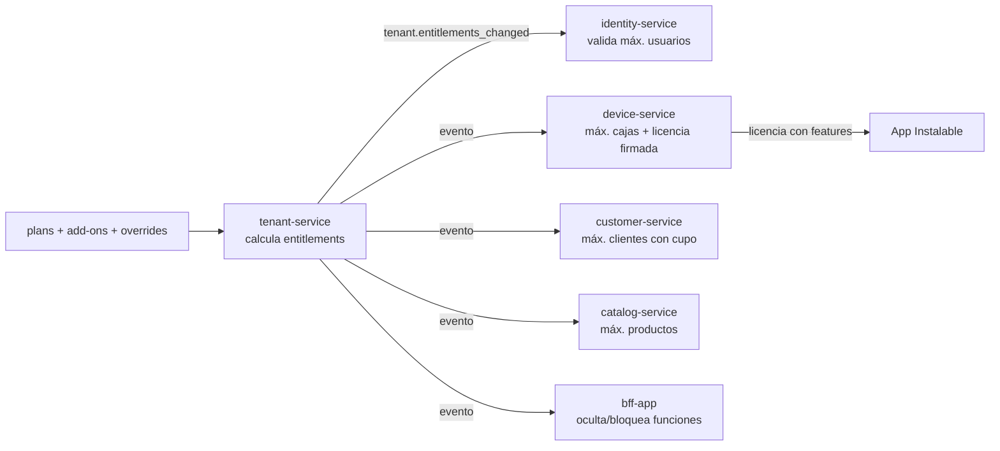
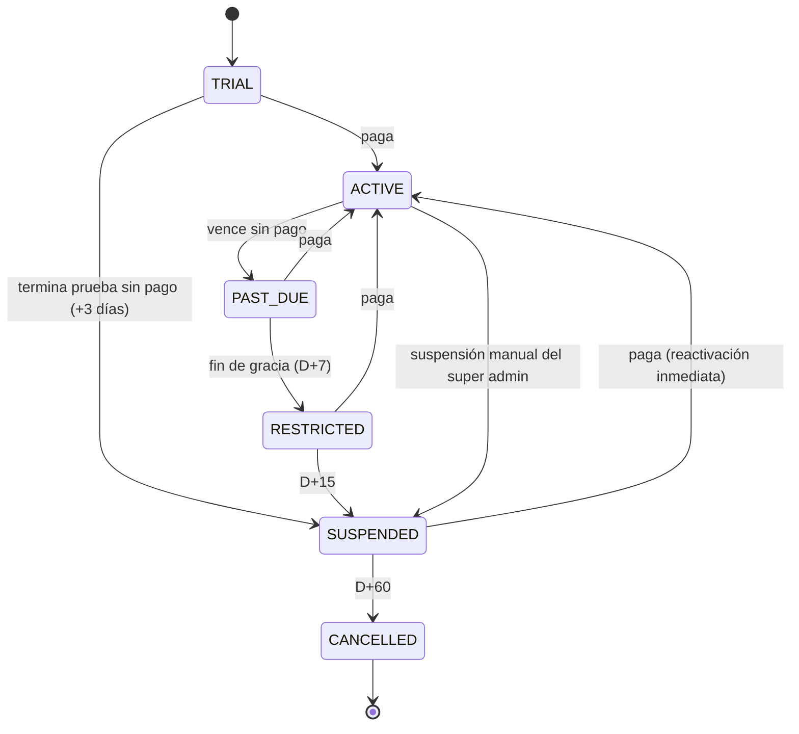
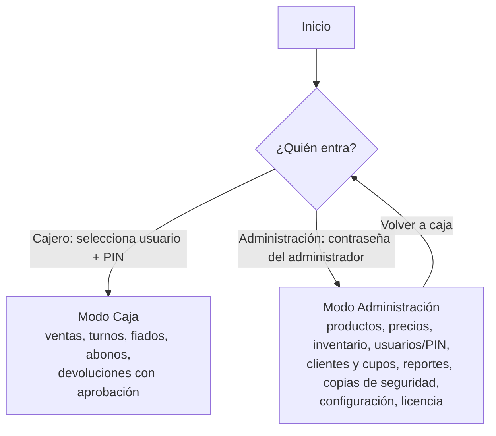
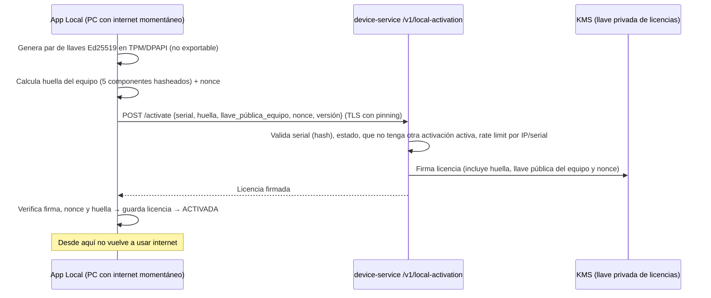
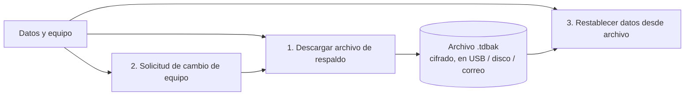
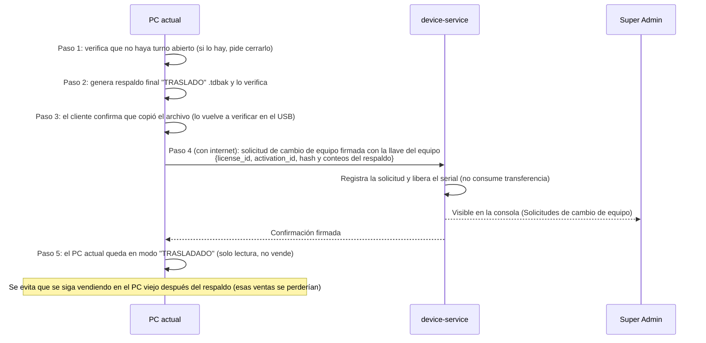

# 10 — Roles, Planes, Cobro y Licenciamiento

Este documento define **quién puede hacer qué**, **qué incluye cada plan**, **cuánto cobrar**, **cómo se avisa y se bloquea por falta de pago** y la **Edición Local de pago único** (sin nube).

Esquemas SQL relacionados:
- [db/cloud/tenant-service/002_plans_billing.sql](../db/cloud/tenant-service/002_plans_billing.sql) — planes, add-ons, facturas SaaS, pagos, avisos, prórrogas.
- [db/cloud/identity-service/002_roles_permissions_seed.sql](../db/cloud/identity-service/002_roles_permissions_seed.sql) — roles del sistema y permisos.
- [db/cloud/device-service/002_local_licenses.sql](../db/cloud/device-service/002_local_licenses.sql) — licencias perpetuas de la Edición Local.
- [db/local/002_local_edition.sql](../db/local/002_local_edition.sql) — tablas extra de la Edición Local.

---

## 1. Modelo de roles

```mermaid
flowchart TD
    SA["SUPER ADMIN (plataforma)<br/>Tú: crea tiendas, dueños, planes, licencias, cobra y bloquea"]
    OW["DUEÑO DE TIENDA (tenant)<br/>Administra todo su negocio según su plan"]
    SUP["SUPERVISOR (opcional, plan Negocio+)<br/>Aprueba anulaciones, descuentos, reaperturas"]
    BA["ADMIN DE SUCURSAL (opcional, plan Multi-tienda)<br/>Administra una sucursal"]
    CA["CAJERO<br/>Vende y lo básico de caja"]
    SA -->|crea tienda + usuario dueño| OW
    SA -.->|puede crear/editar usuarios de cualquier tienda (auditado)| CA
    OW -->|crea, desactiva, cambia PIN| CA
    OW -->|si el plan lo permite| SUP
    OW -->|si el plan lo permite| BA
```

### 1.1 Los tres roles principales

| Rol | Ámbito | Dónde opera | Autenticación | Qué hace |
|---|---|---|---|---|
| **SUPER_ADMIN** | Plataforma completa | Consola interna (`platform-console`) | Usuario + contraseña + **MFA obligatorio (llave física o TOTP)**, IP permitidas | Crear tiendas (tenants) y su usuario dueño; crear/editar usuarios de cualquier tienda; asignar y cambiar planes; registrar pagos manuales; dar prórrogas; suspender/reactivar; generar licencias de la Edición Local; ver salud del sistema. **No vende** ni opera cajas |
| **OWNER (Dueño)** | Su tienda (todas sus sucursales) | App de Gestión (web/móvil) **y** App Instalable (puede vender) | App de Gestión: email + contraseña + MFA. Caja: PIN | Todo lo de su negocio **limitado por su plan**: catálogo, precios, usuarios (cajeros), cajas, inventario, clientes y fiados, reportes, suscripción y pagos |
| **CASHIER (Cajero)** | Su sucursal / su caja | Solo App Instalable | PIN de 4–6 dígitos | Abrir/cerrar turno con arqueo ciego, vender, cobrar, fiar dentro del cupo, recibir abonos, crear cliente rápido, reimprimir (auditado). **No** ve reportes globales, costos ni el efectivo esperado |

### 1.2 Roles opcionales (se habilitan según el plan)

| Rol | Plan mínimo | Para qué |
|---|---|---|
| **SUPERVISOR** | Negocio | Encargado de turno: aprueba anulaciones, devoluciones, descuentos grandes, apertura manual de cajón y reapertura de turno con su PIN |
| **BRANCH_ADMIN** (Admin de sucursal) | Multi-tienda | Administra una sola sucursal (cajeros, inventario, reportes de esa sucursal) |
| **ACCOUNTANT** (Contador, solo lectura) | Negocio | Ve reportes de ventas e impuestos y exporta; no modifica nada |
| **SUPPORT** (soporte de plataforma) | — (interno) | Tus futuros empleados de soporte: acceso de lectura a una tienda solo con autorización temporal (*just-in-time*) y auditado |

En el plan **Tendero** solo existen **Dueño** y **Cajero**: las aprobaciones que haría un supervisor las hace el **dueño con su PIN**.

### 1.3 Reglas de gobierno

- **Solo el SUPER_ADMIN crea tiendas.** El registro público está desactivado (`public_signup = false`). Más adelante se puede abrir un formulario de "solicitud de cuenta" que tú apruebas.
- Al crear la tienda, el sistema envía al dueño un enlace de activación (email/WhatsApp) con **contraseña temporal de un solo uso**; en el primer ingreso debe cambiarla y configurar MFA.
- El dueño crea sus cajeros (hasta el límite del plan). El super admin también puede hacerlo (soporte, acompañamiento inicial); queda auditado con `actor_kind = SUPPORT`.
- Un usuario pertenece a **una sola tienda**. El super admin no pertenece a ninguna.
- Nadie puede aprobar su propia operación (`requested_by ≠ approved_by`), excepto en el plan Tendero cuando el dueño vende y aprueba (queda auditado como "autoaprobado").
- No existe "suplantar" (login como otro usuario). El soporte usa acceso temporal de lectura.

### 1.4 Matriz de permisos

✔ = permitido · A = requiere aprobación de supervisor/dueño · — = no permitido

| Permiso | Cajero | Supervisor | Admin sucursal | Dueño | Super Admin |
|---|:-:|:-:|:-:|:-:|:-:|
| Vender, cobrar, pagos mixtos | ✔ | ✔ | ✔ | ✔ | — |
| Descuento ≤ tope configurado | ✔ | ✔ | ✔ | ✔ | — |
| Descuento mayor / cambio de precio en caja | A | ✔ | ✔ | ✔ | — |
| Vender artículo genérico | A | ✔ | ✔ | ✔ | — |
| Eliminar ítem ya escaneado | ✔ (auditado) | ✔ | ✔ | ✔ | — |
| Anular / devolver | A | ✔ | ✔ | ✔ | — |
| Abrir cajón sin venta | A | ✔ | ✔ | ✔ | — |
| Abrir/cerrar turno, arqueo ciego | ✔ | ✔ | ✔ | ✔ | — |
| Ver efectivo esperado del turno | — | — | ✔ | ✔ | — |
| Reabrir turno | — | ✔ | ✔ | ✔ | — |
| Fiar dentro del cupo / exceder cupo | ✔ / A | ✔ / ✔ | ✔ / ✔ | ✔ / ✔ | — |
| Crear cliente rápido / editar cupos | ✔ / — | ✔ / — | ✔ / ✔ | ✔ / ✔ | — |
| Catálogo y precios | — | — | sucursal | ✔ | ✔ (soporte) |
| Inventario (recepciones, ajustes, conteos) | — | — | ✔ | ✔ | — |
| Usuarios de la tienda | — | — | cajeros de su sucursal | ✔ | ✔ |
| Cajas (crear, revocar) | — | — | — | ✔ | ✔ |
| Reportes de la caja / turno | ✔ | ✔ | ✔ | ✔ | — |
| Reportes de sucursal / globales | — | sucursal (opcional) | sucursal | ✔ | métricas agregadas |
| Costos y márgenes | — | — | opcional | ✔ | — |
| Suscripción y pagos de la tienda | — | — | — | ✔ | ✔ |
| Crear tiendas, planes, licencias locales, prórrogas, suspensiones | — | — | — | — | ✔ |

Los permisos se guardan como códigos atómicos (`sale.void`, `catalog.manage`…); los roles son paquetes de permisos. En el plan **Multi-tienda** el dueño puede crear **roles personalizados**.

---

## 2. Planes SaaS (nube)

### 2.1 Resumen de planes

| | **Tendero** (autoadministrado) | **Negocio** | **Multi-tienda** |
|---|---|---|---|
| Para quién | Tienda de barrio atendida por el dueño, con 1 ayudante | Minimercado / tienda con varios turnos | Dueños con 2 o más locales |
| Sucursales | 1 | 1 | 2 incluidas (+ adicionales) |
| Cajas | 1 | 2 incluidas (hasta 5 con add-on) | 4 incluidas (+ adicionales) |
| Usuarios | Dueño + 1 cajero | Dueño + 6 usuarios | Dueño + 20 usuarios |
| Roles | Dueño, Cajero | + Supervisor, Contador | + Admin de sucursal, roles personalizados |
| Ventas offline, turnos, arqueo ciego | ✔ | ✔ | ✔ |
| Productos | Hasta 3.000 | Ilimitados | Ilimitados |
| Fiados | Hasta 50 clientes con cupo | Ilimitados + modos de cupo + recordatorios por WhatsApp | Igual + cartera por sucursal |
| Inventario | Existencias + recepciones | + ajustes, conteos con cámara, alertas, pedidos sugeridos | + traslados entre sucursales |
| Promociones | — | ✔ | ✔ |
| Reportes | Día, semana, mes, productos top, turnos | Todos + exportar Excel/PDF + auditoría | + consolidados y comparativos entre sucursales, rentabilidad |
| App de Gestión (web + móvil) | ✔ | ✔ | ✔ |
| Notificaciones push | Básicas (descuadre, pago) | Todas | Todas |
| Soporte | WhatsApp en horario laboral | WhatsApp prioritario | Prioritario + acompañamiento de implementación |
| Facturación electrónica (futuro) | Add-on | Add-on | Add-on |

### 2.2 Precios sugeridos (COP)

| Plan | Mensual | Anual (2 meses gratis) |
|---|---|---|
| **Tendero** | **$ 34.900** | **$ 349.000** |
| **Negocio** | **$ 79.900** | **$ 799.000** |
| **Multi-tienda** | **$ 149.900** | **$ 1.499.000** |

| Add-on | Precio mensual |
|---|---|
| Caja adicional | $ 19.900 |
| Sucursal adicional (Multi-tienda, incluye 1 caja) | $ 49.900 |
| 5 usuarios adicionales | $ 9.900 |
| Facturación electrónica (futuro) | $ 29.900 + paquete de documentos |
| Implementación asistida (carga de catálogo, capacitación) | $ 150.000 pago único |

Criterios usados para los precios:
- El plan Tendero debe costar **menos de lo que una tienda de barrio pierde al mes** en descuadres y fiados mal anotados, y estar en el rango de una suscripción de streaming/celular para que la decisión de compra sea fácil.
- La diferencia entre planes la marcan **cajas, usuarios y control** (supervisor, auditoría, inventario completo): lo que necesita un negocio cuando el dueño ya no está todo el día en la caja.
- **Prueba gratis de 15 días** con funciones del plan Negocio; al terminar, el dueño elige plan o pasa a Tendero.
- Anual con descuento para mejorar la retención y el flujo de caja.
- Valores **sugeridos**: valídalos con 10–20 tenderos en el piloto y compáralos con las alternativas que ya usan (cuaderno, Excel, apps gratuitas y POS de la competencia).
- Impuestos: confirma con un contador si el servicio se factura con IVA o si aplica alguna exclusión (por ejemplo, la de servicios de computación en la nube) y si los precios se publican con IVA incluido.
- Precios de lanzamiento: considera 30 % de descuento los primeros 3 meses para los primeros 100 clientes ("fundadores").

### 2.3 Cómo se aplican los límites (entitlements)



- **Entitlements** = `features` y límites del plan + add-ons contratados + excepciones que configures (`tenant_feature_overrides`).
- Cada servicio valida su propio límite al crear (p. ej. `identity-service` rechaza el usuario n.º 3 en Tendero con `PLAN_LIMIT_REACHED`). La UI solo oculta; **la regla vive en el servicio**.
- La caja recibe los features dentro de su **licencia firmada** y los aplica offline (p. ej. sin promociones en Tendero).
- **Upgrade**: inmediato, con cobro prorrateado.
- **Downgrade**: al final del periodo pagado. Si el negocio excede los límites del plan nuevo (más cajas o usuarios), se le pide elegir cuáles desactivar; nunca se borra nada ni se apaga una caja con turno abierto.

---

## 3. Cobro, avisos de pago retrasado y bloqueo

### 3.1 Medios de pago de la suscripción

- **Automático**: tarjeta de crédito/débito o débito recurrente (pasarela: Wompi, PayU o Mercado Pago).
- **Manual** (muy usado por tenderos): link de pago, PSE, Nequi, Daviplata, Bre-B, consignación. El super admin (o la conciliación automática con la pasarela) registra el pago en la consola.
- Cada cobro genera una **factura de la suscripción** (`billing_invoices`) con fecha de corte y fecha límite.

### 3.2 Línea de tiempo (configurable por plan en `dunning_policies`)

| Día (respecto a la fecha de corte) | Estado de la tienda | Qué pasa | Canales |
|---|---|---|---|
| D−5 | `ACTIVE` | Recordatorio: "Tu plan se renueva el …" con link de pago | Email, WhatsApp, push, banner en App de Gestión |
| D0 | `ACTIVE` | Intento de cobro automático o envío de la factura con link de pago | Email, WhatsApp |
| D+1 | `PAST_DUE` | Aviso de pago pendiente. **Banner amarillo** en la App de Gestión. En la caja, aviso **solo al dueño** al iniciar sesión (no al cajero ni frente a clientes) | Todos |
| D+3 | `PAST_DUE` | Segundo aviso + reintento de cobro | Todos |
| D+5 | `PAST_DUE` | **Último aviso**: "El X se restringirá tu cuenta" | Todos + llamada opcional desde la consola |
| D+7 | `RESTRICTED` | App de Gestión en **solo lectura** (no crear productos, usuarios ni cambiar precios); pantalla principal de pago. **La caja sigue vendiendo** para no afectar el negocio | Todos + banner rojo |
| D+15 | `SUSPENDED` | **Bloqueo**: la caja **no permite abrir turnos nuevos** (el turno abierto puede cerrarse y sincronizarse; se puede reimprimir y consultar). App de Gestión: solo pago, descarga de datos y soporte | Todos |
| D+60 | `CANCELLED` | Se cancela la suscripción. Datos conservados 90 días más con opción de exportación; luego eliminación programada con aviso previo | Email, WhatsApp |



### 3.3 Reglas de protección al cliente

- **Nunca se bloquea en medio de un turno**: el bloqueo aplica al abrir el siguiente turno.
- **Nunca se borran ni se ocultan datos** por mora; el dueño siempre puede descargar su información.
- **Reactivación inmediata**: cuando la pasarela confirma el pago (webhook) o tú lo registras, la tienda vuelve a `ACTIVE` y la caja recibe una licencia nueva en el siguiente heartbeat (≤ 60 s si tiene internet).
- **Prórroga**: desde la consola puedes dar días extra con motivo (p. ej. "pagará el viernes"). Queda auditado y se puede limitar (máx. 2 por año).
- Los avisos se envían en horario razonable (8 a. m. – 7 p. m.), con tono respetuoso y sin mensajes al cajero.

### 3.4 ¿Cómo se bloquea una caja que no tiene internet?

Con la **licencia firmada** que la caja guarda (ver [04 §2.3](04-seguridad.md)):

```text
licencia.exp = mínimo( fecha_pagada_hasta + 15 días,  última_conexión + días_de_gracia_offline )
```

- Si la caja no se conecta, igualmente se bloquea al llegar a `exp` (no puede "escaparse" del cobro quedándose sin internet).
- Si el pago se hace mientras la caja está offline, se desbloquea en cuanto se conecte.
- Cambiar la hora del PC no sirve: la caja detecta retrocesos del reloj ([03 §10](03-sincronizacion-offline.md)).

### 3.5 Funciones del super admin en la consola

| Función | Detalle |
|---|---|
| Crear tienda | Datos del negocio, plan, fecha de corte, dueño (nombre, email, celular) → envía activación |
| Gestionar usuarios | Crear/desactivar usuarios en cualquier tienda, reenviar activación, resetear MFA (con verificación de identidad) |
| Planes y precios | Editar planes, add-ons, cupones y precios de lanzamiento |
| Cobros | Ver facturas, registrar pago manual (con comprobante), reintentar cobro, emitir nota de ajuste |
| Morosidad | Lista de tiendas en `PAST_DUE`/`RESTRICTED`/`SUSPENDED`, días de mora, último aviso, botón de prórroga, suspensión/reactivación manual |
| Licencias locales | Generar, transferir y revocar licencias de la Edición Local (§4) |
| Salud | Cajas sin sincronizar, lag de eventos, errores, versiones instaladas |
| Métricas de negocio | MRR, clientes por plan, churn, mora, conversión de prueba |

---

## 4. Edición Local (licencia de pago único; internet solo para activar)

Producto alternativo para tenderos que **no quieren pagar mensualidad ni depender de internet**. Es la **misma App Instalable** compilada en modo `LOCAL`: todo queda en el computador, sin nube, sin App de Gestión y sin sincronización. **Internet se necesita una sola vez, para activar la licencia**; después la aplicación no vuelve a conectarse.

### 4.1 Comparación

| | SaaS (nube) | **Edición Local** |
|---|---|---|
| Pago | Mensual / anual | **Único** (+ actualizaciones opcionales) |
| Internet | Solo para sincronizar y administrar | **Solo una vez para activar** (y para transferir a otro PC); después nunca |
| Dónde se administra | App de Gestión (web/móvil) | **En el mismo PC**, opción "Administración" con contraseña |
| Reportes desde el celular | ✔ | ✗ (solo en el PC) |
| Cajas | Varias, varias sucursales | **1 PC = 1 caja** |
| Copias de seguridad | Automáticas en la nube | **Responsabilidad del cliente** (USB / disco externo, asistidas por la app) |
| Si el PC se daña | Se reinstala y se recupera todo | Se recupera solo desde la última copia |
| Avisos de pago / bloqueo | ✔ | No aplica (licencia perpetua) |
| Actualizaciones | Automáticas | Instalador manual, incluidas 1 año |

### 4.2 Modos de la aplicación



- **Cajero**: igual que la caja SaaS.
- **Administración**: protegida con contraseña (mín. 8 caracteres, Argon2id, bloqueo tras 5 intentos fallidos durante 5 min, crecientes). El dueño también puede tener PIN para aprobar operaciones en caja.
- Las pantallas de administración y reportes son **las mismas de la App de Gestión** (componentes React Native Web compartidos en `packages/admin-ui`), conectadas a un **proveedor de datos local** (Tauri → Rust → SQLite) en vez de a la nube. Un solo desarrollo, dos destinos.

### 4.3 Activación en línea (una sola vez)

Al comprar, el cliente recibe un **serial** (ej. `TDL-7KQ2M-9XA44-TPB8R-W3ZQN`). En la nube solo se guarda su hash.



Contenido de la licencia (firmado; la app no puede modificarlo sin invalidar la firma):

```json
{ "lid": "LOC-2026-000123", "aid": "act-uuid", "edition": "LOCAL_PLUS", "customer": "Tienda Doña Marta",
  "doc": "CC 52.xxx.xxx", "machine": { "cpu": "h1", "board": "h2", "disk": "h3", "os_guid": "h4", "mac": "h5" },
  "device_pubkey": "base64-ed25519", "nonce": "…", "max_users": 0,
  "features": ["credit","inventory_full","reports_full","export"],
  "updates_until": "2027-10-03", "issued_at": "2026-10-03T15:20:00Z", "kid": "lic-2026" }
```

Verificación en cada arranque (offline):
1. Firma de la licencia válida con la llave pública embebida en la app.
2. Huella del equipo: coinciden **al menos 3 de 5** componentes (un cambio de disco o de tarjeta de red no la invalida).
3. **Prueba de posesión**: la app firma un desafío aleatorio con la llave privada del TPM/DPAPI y lo verifica contra `device_pubkey`. Copiar la carpeta del programa y la base a otro PC no funciona, porque la llave privada no se puede exportar.

Por qué la activación en línea evita la copia:
- **Un serial = un equipo activo.** Si el mismo serial se intenta activar en otro PC, la nube lo rechaza (`ALREADY_ACTIVATED`) y te alerta en la consola (posible serial compartido o revendido).
- La licencia la firma la nube en el momento; no hay "generador de claves" que se pueda filtrar ni códigos que se reenvíen por WhatsApp.
- Ves en la consola cuándo, desde qué ciudad/IP y en qué equipo se activó cada licencia.

Reglas:
- **Perpetua**: no vence. Lo único con fecha es `updates_until`, comparado con la **fecha de compilación** de la versión instalada (no con el reloj del PC).
- **Reinstalar en el mismo PC**: se vuelve a activar en línea con el mismo serial; la nube reconoce la huella (≥ 3 de 5) y reemite la licencia **sin consumir transferencias**.
- **Cambio de PC**: se hace con el asistente **"Solicitud de cambio de equipo"** (§4.5), que primero descarga el archivo con todos los datos y luego libera la licencia. Si el PC se dañó, tú liberas la activación desde la consola (máx. 2 por año) y los datos se recuperan del último archivo de respaldo.
- **Revocación**: si revocas un serial (contracargo, fraude), ya no podrá activarse ni reactivarse. Un equipo que ya estaba activado y nunca se conecta seguirá funcionando: es el costo de "cero internet después de activar" y es aceptable porque no puede propagarse a otros equipos.
- **Piratería residual**: se reduce además con binario firmado (Authenticode), verificación de integridad, llave pública embebida en varios puntos y licencias nominativas (nombre y documento del comprador en "Acerca de" y en los reportes).
- **Prueba de 15 días**: también se inicia en línea (una prueba por equipo, registrada por huella); devuelve una licencia de prueba firmada con fecha de fin. Al vencer, el modo Caja se bloquea hasta activar.
- **Sin internet al activar**: la app muestra cómo conectarse (Wi-Fi, compartir datos del celular por USB/hotspot). No existe activación offline.

### 4.4 Contraseña de administrador olvidada

1. **Código de recuperación**: en la instalación inicial la app genera un código de 16 caracteres que el dueño imprime o anota. Con él puede crear una nueva contraseña.
2. **Recuperación por soporte** (requiere internet en ese momento): la app envía una solicitud firmada con la llave del equipo; tú la apruebas en la consola tras verificar la identidad del comprador y la app recibe un permiso de un solo uso para crear una contraseña nueva. Queda auditado en ambos lados.

### 4.5 Respaldo de datos, solicitud de cambio de equipo y restauración

Como la Edición Local no guarda nada en la nube, la app ofrece en **Administración → Datos y equipo** tres opciones para que el cliente **nunca pierda su información**:



#### 1) Descargar archivo de respaldo

- Genera un archivo **`TiendaDonaMarta_2026-10-03_1830.tdbak`** con **todos los datos**: productos, precios, inventario, clientes y fiados, ventas, turnos, usuarios y PIN, configuración y auditoría.
- El cliente elige dónde guardarlo (USB, disco externo, carpeta de Google Drive/OneDrive sincronizada por él). La app **verifica el archivo después de escribirlo** (lo vuelve a leer y compara el hash) y muestra "Respaldo verificado ✔".
- **Cifrado** con AES-256-GCM; la clave se deriva (Argon2id) del **código de recuperación**, así que el archivo no sirve en manos de otra persona y se puede restaurar en otro PC.
- Contenido del archivo:

```text
.tdbak = encabezado (versión de formato, sal, nonce) + cifrado {
  manifest.json  → negocio, license_id, versión de la app, schema_version, fecha, conteos
                   (productos, clientes, ventas, última venta), sha256 de la base
  database.sqlite → copia consistente (SQLite Online Backup API, sin cerrar la app)
}
```

- Copias automáticas: al cerrar cada turno y diariamente en una carpeta local (últimas 30), más **recordatorio semanal** si no se ha guardado un respaldo en un medio externo en 7 días.

#### 2) Solicitud de cambio de equipo (asistente)

Para cambiar de computador, formatear o reinstalar sin perder nada:



- **Sin internet en el paso 4**: el respaldo se genera igual y el PC queda marcado "pendiente de liberar"; la solicitud se envía cuando haya conexión, o el cliente te contacta y tú liberas el serial desde la consola indicando el hash del respaldo que te comparte.
- **PC dañado (sin poder hacer el asistente)**: tú liberas la activación desde la consola (cuenta como transferencia) y el cliente restaura su último `.tdbak`.
- El hash y los conteos del respaldo quedan registrados en la nube (**solo metadatos, nunca los datos**), para que soporte pueda confirmar que el cliente restauró el archivo correcto.

#### 3) Restablecer datos desde archivo

Disponible en el **asistente de primera configuración** del PC nuevo ("¿Tienes un archivo de respaldo?") y en **Administración → Datos y equipo → Restablecer**.

1. El cliente selecciona el `.tdbak` e ingresa su **código de recuperación**.
2. La app valida: integridad (etiqueta GCM + sha256), formato y `schema_version` (si es de una versión anterior, migra; si es de una versión más nueva que la instalada, pide actualizar la app).
3. Muestra un **resumen antes de confirmar**: nombre del negocio, fecha del respaldo, número de productos, clientes, ventas y fecha de la última venta.
4. Antes de reemplazar, la app hace un **respaldo automático de los datos actuales** (por si se eligió el archivo equivocado).
5. Restaura, reinicia y pide iniciar sesión con la contraseña de administrador del respaldo.
6. Si el respaldo era de un "cambio de equipo", al tener internet la app notifica que el traslado se completó (cierra la solicitud en la consola).

Reglas:
- El respaldo pertenece a una licencia: se restaura en un equipo activado con **la misma licencia** (o una mejora de ella, p. ej. Esencial → Plus). Restaurar en otra licencia requiere tu aprobación desde la consola (evita revender datos/licencias).
- Restaurar **reemplaza** todos los datos del equipo; la app lo advierte dos veces.
- Restablecer no requiere internet (solo el archivo y el código de recuperación).
- Si el cliente perdió el código de recuperación, el respaldo **no se puede abrir**: por eso la app obliga a confirmarlo al instalar y permite reimprimirlo desde Administración (con la contraseña).
- Al vender la Edición Local se debe explicar por escrito (EULA) que la custodia de los datos y de los archivos de respaldo es del cliente.

### 4.6 Actualizaciones

- Instaladores descargables desde la web (o enviados por WhatsApp/USB), firmados.
- El instalador lee la licencia: si la versión es posterior a `updates_until`, avisa y no instala ("Renueva tus actualizaciones para instalar esta versión"). La versión que ya tiene sigue funcionando para siempre.
- Al renovar, el cliente pulsa **Administración → Licencia → Actualizar licencia** (requiere internet en ese momento) y descarga la licencia con el nuevo `updates_until`.
- Las migraciones de la base local se ejecutan con copia de seguridad previa automática.

### 4.7 Paso de Local a la nube

Si el negocio crece: Administración → "Pasar a TienditaOnline Cloud" genera un paquete cifrado con productos, clientes y saldos de fiado, inventario e histórico de ventas. Tú creas la tienda SaaS en la consola, importas el paquete y la licencia local se marca como migrada (se puede ofrecer el valor pagado como crédito).

### 4.8 Precios sugeridos — Edición Local

| Edición | Pago único | Incluye |
|---|---|---|
| **Local Esencial** | **$ 449.000** | 1 PC, administrador + 2 cajeros, ventas, turnos y arqueo, inventario básico, fiados (50 clientes), reportes básicos, 1 año de actualizaciones |
| **Local Plus** | **$ 749.000** | 1 PC, cajeros ilimitados, fiados ilimitados con cupos, inventario completo, todos los reportes, exportación a Excel, 1 año de actualizaciones |
| Renovación de actualizaciones (opcional) | $ 129.000 / año | Nuevas versiones y soporte por WhatsApp |
| Transferencia extra de PC / instalación asistida | $ 50.000 | Remota |

Referencia: Local Esencial ≈ 13 meses del plan Tendero; así la nube sigue siendo atractiva (celular, multi-caja, respaldo) y la Edición Local captura al cliente que no quiere mensualidad.

### 4.9 Implementación técnica

| Aspecto | Decisión |
|---|---|
| Código | Mismo proyecto Tauri con *feature flags* de compilación: `cloud` (sync, licencia SaaS) y `local` (administración local). El build `local` **no incluye** el cliente de sincronización; solo un cliente HTTP mínimo para activar, desactivar y recuperar contraseña por soporte |
| Red | El build `local` solo se conecta cuando el usuario pulsa Activar / Desactivar / Recuperación por soporte, únicamente a `api.tienditaonline.co/v1/local-activation/*`. Nunca en segundo plano |
| Base de datos | [db/local/001_schema.sql](../db/local/001_schema.sql) + [db/local/002_local_edition.sql](../db/local/002_local_edition.sql) (inventario, compras, usuarios, licencia, copias) |
| Inventario | Mismo libro de movimientos; aquí `stock_levels` se calcula localmente |
| Reportes | Consultas SQL locales con las mismas definiciones de reporte que `reporting-service` |
| Facturación electrónica | No aplica (mismo modo `fiscal_mode = NONE`) |
| Datos personales | Quedan en el PC del cliente; tú no eres encargado del tratamiento. El EULA debe indicarlo |
